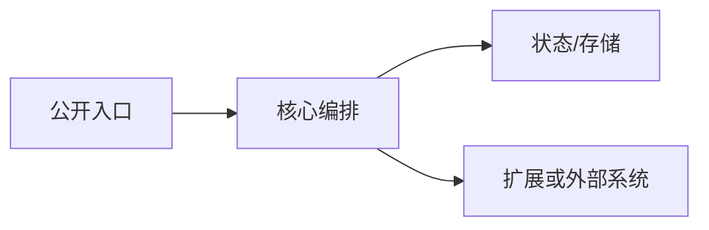

# 代码深度调研模板

只使用本文件中的三个模板。可以根据项目特性增减二级分析章节，但不得增加第四份交付文档。

## 唯一目录结构

```text
research/codedeepresearch/<repo_name>/
├── upstream/                         # 本地克隆；必须忽略，不提交
├── <repo_name>_source_notes.md
├── <repo_name>_code_index.md
└── <repo_name>_deepwiki.md
```

当仓库为 `semantica-agi/semantica` 时，三个文件固定命名为：

```text
semantica_source_notes.md
semantica_code_index.md
semantica_deepwiki.md
```

## 模板一：Source Notes

```markdown
# <repo_name> 源码深度笔记

## 1. 研究边界与固定版本

| 字段 | 内容 |
|---|---|
| 上游仓库 | <URL> |
| 分支/标签 | <branch-or-tag> |
| 固定 SHA | `<sha>` |
| 许可证 | <license> |
| 研究方式 | 静态审阅 / 隔离运行验证 |
| 未覆盖范围 | <明确列出> |

## 2. 核心结论

<用 3–6 个完整段落概括项目解决的问题、核心技术路径和重要边界。不要写采用裁决。>

## 3. 系统边界与核心抽象

| 抽象/模块 | 责任 | 关键不变量 | Evidence ID |
|---|---|---|---|

## 4. 端到端执行路径



<按一次代表性请求或数据单元，解释控制流、数据流和状态变化。>

## 5. 数据、状态与持久化

| 状态/数据 | 创建者 | 生命周期 | 一致性/版本语义 | Evidence ID |
|---|---|---|---|---|

## 6. 失败、恢复与可观测性

| 失败场景 | 传播/处理方式 | 恢复或降级 | 可观测信号 | Evidence ID |
|---|---|---|---|---|

## 7. 扩展机制与安全边界

| 扩展点/边界 | 契约 | 隔离或校验 | 已知限制 | Evidence ID |
|---|---|---|---|---|

## 8. 测试与运行验证

| 项目 | 结果 |
|---|---|
| 实际执行命令 | <命令或“未执行”> |
| 退出状态 | <状态> |
| 测试证明范围 | <说明> |
| 不能证明的事项 | <说明> |

## 9. Evidence Ledger

| Evidence ID | 实现主张 | 来源类型 | 精确位置 | 固定 SHA | 置信度 |
|---|---|---|---|---|---|
| E-001 | ... | local-source | `<path>:<lines> · <symbol>` | `<sha>` | 高 |

## 10. 经核验结论与限制

<汇总来自本地源码和 DeepWiki 交叉核验后的安全结论；引用 Q-ID 与 Evidence ID，但不要复制完整问答。>
```

## 模板二：Code Index

```markdown
# <repo_name> 代码索引

## 1. 来源与工具状态

| 字段 | 内容 |
|---|---|
| 上游 URL | <URL> |
| 本地克隆路径 | `research/codedeepresearch/<repo_name>/upstream/` |
| 固定 SHA | `<sha>` |
| DeepWiki | 可用 / 不可用 / 失败；索引 SHA |
| 运行验证 | 已执行 / 仅静态审阅 / 阻塞 |

## 2. 核心目录树

```text
<仅展示 2–3 层，与核心执行路径相关的目录；用注释标出责任>
```

## 3. 实际阅读文件

| 文件 | 证据类别 | 已检查符号 | 研究目的 |
|---|---|---|---|

## 4. 关键符号

| 符号 | `SHA + path:line-range` | 责任 | 关联 Evidence/Q-ID |
|---|---|---|---|

## 5. 代表性调用与数据关系

| 起点 | 关键中间层 | 终点/副作用 | 证据 |
|---|---|---|---|

## 6. 测试与示例索引

| 测试/示例 | 覆盖行为 | 断言边界 | 未证明事项 |
|---|---|---|---|

## 7. 检索覆盖

| 类型 | 内容 |
|---|---|
| 已检查路径 | ... |
| 精确符号 | ... |
| 同义词/概念词 | ... |
| 协议/配置字段 | ... |
| 未覆盖模块 | ... |

## 8. 高信号 Issue/PR（如适用）

| 编号 | 主题 | 与当前源码的关系 | URL |
|---|---|---|---|

<不可用时写“未检索；不影响锁定源码的静态结论”。>
```

## 模板三：DeepWiki 深问与源码核验

```markdown
# <repo_name> DeepWiki 深问与源码核验

## 1. 版本与证据边界

| 字段 | 内容 |
|---|---|
| 本地源码固定 SHA | `<sha>` |
| DeepWiki URL | <URL> |
| DeepWiki 索引 SHA | `<sha>` / unknown |
| 版本关系 | 相同 / DeepWiki 较旧 / DeepWiki 较新 / 无法判断 |
| 证据规则 | DeepWiki 为辅助解释；本地锁定源码为实现事实来源。 |

## 2. 问题生成方法

<说明先阅读了哪些入口、核心抽象、执行路径、状态、失败处理、扩展点和测试；说明如何从代码观察中筛选 5–10 个问题。>

## 3. 初始问题总表

| Q-ID | 技术主题 | 代码锚点 | 已观察事实 | 未知设计点 | 研究价值 |
|---|---|---|---|---|---|
| Q-01 | ... | `<sha> · <path>:<lines> · <symbol>` | ... | ... | ... |

## 4. 逐题问答与回源核验

### Q-01 · <问题标题>

**代码锚点**

- `<sha> · <path>:<lines> · <symbol>`

**已观察事实**

<仅写本地源码已证明的事实。>

**发给 DeepWiki 的问题**

> <包含机制、边界与权衡的完整问题；要求指向实现和测试。>

**DeepWiki 回答摘要**

<忠实摘要；没有有效回答时写明失败状态与原因。>

**DeepWiki 指向的证据**

| 文件/符号/资料 | DeepWiki 主张 | 可定位性 |
|---|---|---|

**本地源码复核**

| 待核验主张 | 本地证据 | 状态 | 纠正后的安全表述 |
|---|---|---|---|
| ... | E-xxx / `<path>:<lines>` | 已验证 / 部分验证 / 与源码冲突 / 未验证 | ... |

**追问（仅在必要时）**

> <最多两次聚焦追问；没有则写“无”。>

**结论**

<用一段话说明该问题最终揭示的设计细节、边界和仍未知事项。>

<!-- 按 Q-02 至 Q-10 重复；初始问题总数必须为 5–10。 -->

## 5. 综合核验矩阵

| Q-ID | 主题 | 最终状态 | 关键 Evidence | 对 Source Notes 的影响 |
|---|---|---|---|---|

## 6. 未验证项与后续源码阅读入口

| 未验证项 | 原因 | 下一步应检查的文件/测试/运行验证 |
|---|---|---|
```

## 文档一致性规则

三份文档必须使用同一个固定 SHA、相同的 Evidence ID 和 Q-ID。Source Notes 负责解释机制，Code Index 负责定位证据，DeepWiki 文档负责保存问题、回答和回源裁决。不要在三个文件中复制大段相同文字，也不要将 DeepWiki 生成内容直接提升为高置信度实现事实。
