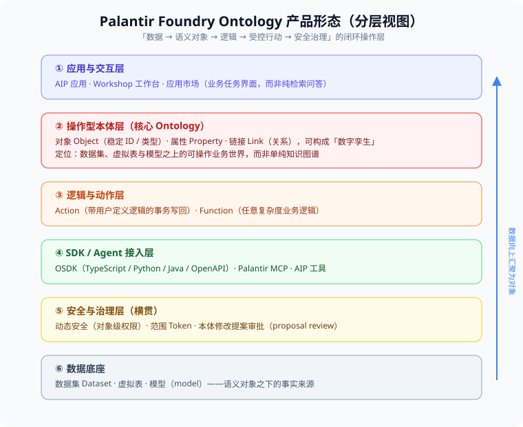
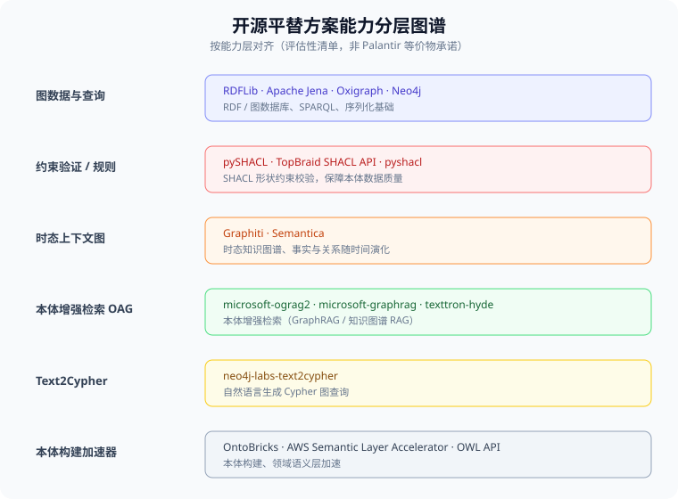
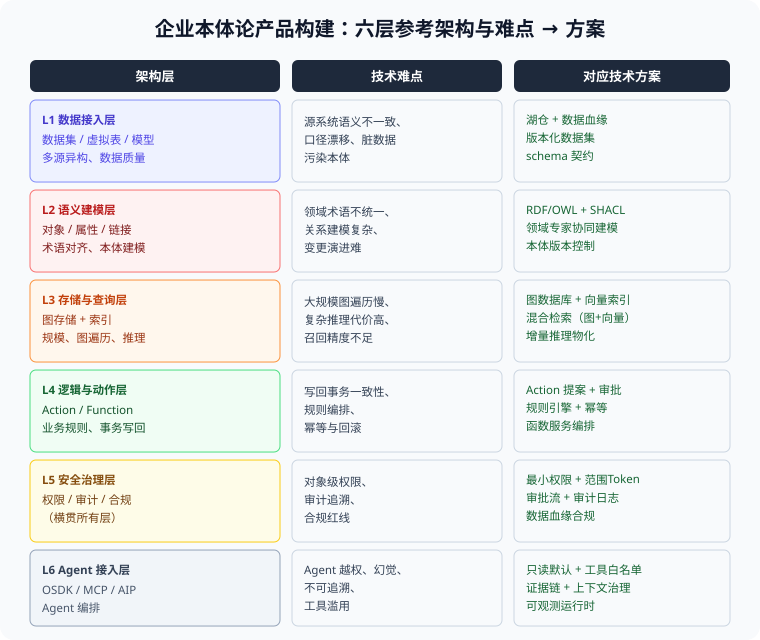
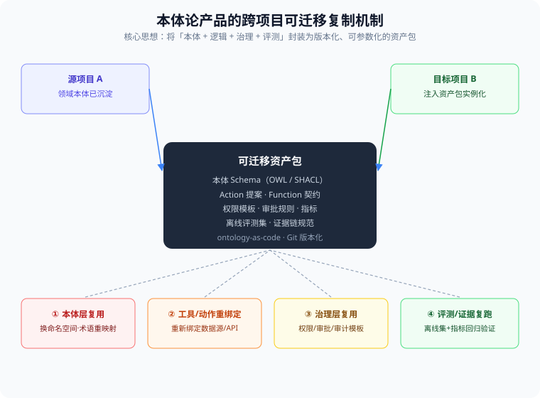

# Palantir 本体论产品与开源平替：调研报告

> 本报告基于 `oag-deep-research` 仓库的调研材料整理。所有结论区分三类证据：Palantir 官方产品文档与技术博客（描述公开产品主张）、同行评审论文与公开实现（建立可验证基线）、以及本仓库本地浅克隆的静态评估。
>
> 配图采用 SVG 与 GIF 动画，SVG 位于 `assets/` 目录，数据流图位于 `prototype/prototype-near/out/`。

---

## 执行摘要

本报告回答四个核心问题：Palantir 本体论产品是什么、开源平替有哪些、企业如何自建、如何跨项目迁移。

**核心结论**：

1. Palantir Ontology 不是知识图谱产品，而是 Foundry 平台内建的**操作型语义层**——对象可写、动作可治理、权限可下沉到实例级。
2. 没有任何单一开源项目是 Foundry 的 1:1 等价物。开源组件能覆盖图存储、约束校验、检索增强等能力层，但难以覆盖一体化操作型本体、企业级治理、平台级工程化三个护城河。
3. 企业自建的最高风险点是**语义建模成本**（P0）和**受控写回一致性**（P0），其次是图向量混合检索（P1）和 Agent 可治理接入（P1）。
4. 跨项目迁移的关键是「ontology-as-code」——将本体骨架与领域术语分离，封装为版本化资产包，在目标项目中实例化而非复制代码。
5. 本团队已构建 OAG Prototype（三场景：制造供应链、南网能源、银行反洗钱），验证了 L2-L4 层的可行性，L1/L5/L6 层尚待补全。

---

## 一、Palantir 的本体论产品有哪些，产品形态如何

### 1.1 产品定位

Palantir 的核心产品是 **Foundry** 及其上的 **AIP（AI Platform）**，其本体论能力统称为 **Ontology（本体）**。它不是一个独立售卖的知识图谱产品，而是 Foundry 平台内建的**操作型语义层**。

Palantir 的 Ontology 一句话定位：**把企业分散的数据、业务规则、业务动作和权限，组织成同一套「可操作业务世界」，再在这个世界之上承载应用、分析与 Agent**。它区别于传统知识图谱的关键在于：本体不是给分析师查询用的静态图，而是业务系统的**可写、可动作、可治理**的数字孪生底座。

### 1.2 产品形态（分层视图）

从下到上六层，构成 Palantir 本体的完整产品形态：

| 层级 | 组件 | 产品形态说明 |
|------|------|-------------|
| ① 应用与交互层 | AIP 应用、Workshop 工作台、应用市场 | 员工看到的是**业务任务界面**（告警/任务收件箱、共同运营态势图），而非检索问答框 |
| ② 操作型本体层 | Object（对象）、Property（属性）、Link（链接） | **核心**。对象有稳定 ID 与类型，可构成数字孪生；定位在数据集/虚拟表/模型之上 |
| ③ 逻辑与动作层 | Action、Function | Action 是带用户定义逻辑的**事务写回**；Function 承载任意复杂度业务逻辑 |
| ④ SDK / Agent 接入层 | OSDK（TS/Python/Java/OpenAPI）、Palantir MCP、AIP 工具 | 让外部系统与 Agent 以受控方式读写本体 |
| ⑤ 安全与治理层 | 动态安全（对象级权限）、范围 Token、本体修改提案审批 | **横贯所有层**，是 Palantir 的差异化壁垒 |
| ⑥ 数据底座 | 数据集 Dataset、虚拟表、模型（model） | 语义对象之下的事实来源 |

### 1.3 关键产品特征

- **对象是操作的主体，不是标签**：Ontology 的对象承载业务身份（如「客户」「订单」「资产」），可被 Action 写回、被 Agent 操作，这是它与普通知识图谱最本质的区别。
- **动作可治理**：所有对对象的写操作走 Action 提案 + 审批（proposal review），配合对象级权限与范围 Token，实现「谁能对哪个对象做什么」的细粒度控制。
- **数字孪生**：Ontology 通过对象 + 链接把物理/业务世界镜像成可计算图，AIP 在此基础上提供 Agent 工具调用与推理。

---

## 二、开源的平替产品方案（开源 GitHub 仓库）有哪些

> 注意：没有任何单一开源项目是 Palantir Foundry 的 1:1 等价物。以下是按能力层对齐的**评估性清单**，用于说明「用开源组合能拼出本体论产品的哪些能力」。

| 能力层 | 代表开源仓库 | 说明 |
|--------|-------------|------|
| 图数据与查询 | RDFLib、Apache Jena、Oxigraph、Neo4j | RDF / 图数据库、SPARQL、序列化基础设施 |
| 约束验证 / 规则 | pySHACL、pyshacl、TopBraid SHACL API | 用 SHACL 形状约束校验本体数据质量 |
| 时态上下文图 | Graphiti、Semantica | 支持事实与关系随时间演化的时态知识图谱 |
| 本体增强检索（OAG/GraphRAG） | microsoft/ograg2、microsoft/graphrag、texttron/hyde | 用本体/图结构增强 RAG 检索 |
| Text2Cypher | neo4j-labs/text2cypher | 自然语言转 Cypher 图查询 |
| 本体构建加速器 | OntoBricks、AWS Semantic Layer Accelerator、OWL API | 本体构建与领域语义层加速 |

### 2.1 开源组合的边界（重要）

调研结论明确：开源工具**能覆盖**「图存储、约束校验、检索增强、本体构建」等能力层，但**难以覆盖** Palantir 的三个护城河：

1. **一体化操作型本体**（对象 + Action 写回 + 动态安全的紧耦合）；
2. **企业级治理与权限**（对象级安全、审批流、审计的深度集成）；
3. **平台级工程化**（数据集版本化、血缘、多租户、可观测）。

因此「开源平替」的正确姿态是：**用开源组件自建一个满足自身场景的语义层 + 操作层**，而非寻找等价替代品。

---

## 三、企业如何构建本体论产品：技术难点与对应方案

### 3.1 六层参考架构

#### 数据流全景

下图展示 Ontology 从数据源到业务应用的完整数据流，涵盖六层架构之间的数据流向、Action 写回闭环、安全治理横贯、以及审计追溯：

**数据流解读**：

- **正向链路**：数据源 → 数据接入（Schema 映射）→ 语义建模（对象+链接+属性）→ 图存储+向量索引 → 逻辑与动作（混合检索）→ Action 写回 / Agent 接入 → 业务应用。
- **闭环链路**：Action 写回通过事务机制将变更同步回图存储，形成本体数据的自更新闭环；业务应用的反馈通过 Agent 回传至逻辑层。
- **横贯治理**：安全治理层向下覆盖语义建模（对象级权限）、Action 写回（范围 Token）、Agent 接入（工具白名单），确保每一层的数据操作都在受控范围内。
- **审计追溯**：Action 写回与 Agent 操作均产生审计日志和证据链，形成全链路可追溯的合规记录。

### 3.2 逐层技术难点与对应方案

| 架构层 | 技术难点 | 对应技术方案 |
|--------|---------|-------------|
| **L1 数据接入层** | 源系统语义不一致、口径漂移、脏数据污染本体 | 湖仓一体 + 数据血缘；版本化数据集；schema 契约 |
| **L2 语义建模层** | 领域术语不统一、关系建模复杂、变更演进难 | RDF/OWL + SHACL；领域专家协同建模；本体版本控制 |
| **L3 存储与查询层** | 大规模图遍历慢、复杂推理代价高、召回精度不足 | 图数据库 + 向量索引；混合检索（图+向量）；增量推理物化 |
| **L4 逻辑与动作层** | 写回事务一致性、规则编排、幂等与回滚 | Action 提案 + 审批；规则引擎 + 幂等；函数服务编排 |
| **L5 安全治理层** | 对象级权限、审计追溯、合规红线 | 最小权限 + 范围 Token；审批流 + 审计日志；数据血缘合规 |
| **L6 Agent 接入层** | Agent 越权、幻觉、不可追溯、工具滥用 | 只读默认 + 工具白名单；证据链 + 上下文治理；可观测运行时 |

### 3.3 五个最关键的技术难点（聚焦）

1. **语义建模成本**：把业务术语对齐成一致的本体是最大人力瓶颈。方案：本体建模工程化（OWL/RDF + SHACL 约束）、领域专家低代码协同、本体版本控制（ontology-as-code）。
2. **图与向量的混合检索**：纯图遍历精确但稀疏、纯向量语义好但丢失关系。方案：GraphRAG 式「图结构 + 向量索引」混合召回，按本体关系做多跳扩展。
3. **受控写回（Action 一致性）**：让 Agent 或应用安全写对象而不破坏一致性。方案：Action 提案 + 审批流 + 幂等设计 + 事务边界。
4. **对象级安全与治理**：权限必须下沉到「对象实例」而非表级。方案：范围 Token + 最小权限 + 全链路审计。
5. **Agent 可治理接入**：幻觉与越权是最大风险。方案：只读默认、工具白名单、证据链约束、可观测运行时。

---

## 四、本体论产品如何在不同的项目下实现可迁移复制

### 4.1 核心思想

可迁移的关键是：**将「本体 + 逻辑 + 治理 + 评测」封装为版本化、可参数化的资产包（ontology-as-code），通过 Git 版本管理，在目标项目中「实例化」而非「复制代码」**。

### 4.2 四个迁移维度

| 维度 | 迁移方式 | 关键动作 |
|------|---------|---------|
| ① 本体层复用 | 复用本体 Schema（OWL + SHACL 形状） | 换命名空间、术语重映射到目标领域词汇 |
| ② 工具 / 动作重绑定 | 复用 Action 提案与 Function 契约 | 重新绑定目标项目的数据源 / API |
| ③ 治理层复用 | 复用权限模板、审批规则、审计规范 | 按目标组织架构重配角色 |
| ④ 评测 / 证据复跑 | 复用离线评测集 + 指标 | 在新数据上重跑回归，验证迁移有效性 |

### 4.3 落地方法论（三步）

1. **资产化**：把本体的 schema、Action 契约、Function 逻辑、权限模板、评测集全部以代码/配置文件形式纳入 Git 版本控制，形成单一可引用的「本体资产包」。
2. **参数化**：把与具体项目耦合的部分（数据源地址、术语映射表、角色矩阵、API 端点）抽象为可配置参数，本体结构本身保持稳定。
3. **实例化 + 回归**：目标项目导入资产包 → 注入参数 → 重绑定数据/工具 → 用离线评测集做回归验证，确认语义一致性与治理合规后再上线。

### 4.4 可迁移性成立的前提

- **本体的「领域无关骨架」与「领域相关术语」分离**：骨架（对象-属性-链接-动作的元模型）可跨项目复用，术语层按项目重映射。
- **治理与逻辑解耦**：审批流、权限、Action 提案这些治理机制是通用的，可随资产包迁移；业务规则按项目注入。
- **评测先行**：没有离线评测集，迁移就成了「盲改」。评测集是迁移质量的唯一客观标尺。

---

## 附：资料来源

本报告结论来自 `oag-deep-research` 仓库以下核心材料：

- `research/02-palantir-ontology-platform/DEEP_RESEARCH.md` — Palantir Ontology 平台模型深度研究
- `research/02-palantir-ontology-platform/deliverables/palantir-product-shape-and-user-workflows.md` — 产品形态与员工工作流
- `research/02-palantir-ontology-platform/deliverables/palantir-ontology-oag-expanded-research.md` — 扩展研究与可迁移架构
- `research/06-evaluation-selection-and-case-studies/deliverables/ontology-open-source-tool-landscape.md` — 开源工具静态评估
- `research/06-evaluation-selection-and-case-studies/deliverables/enterprise-ontology-and-tooling-roadmap.md` — 企业落地路线
- `.conclusions/palantir-ontology-research-expansion.md` — 维护摘要
