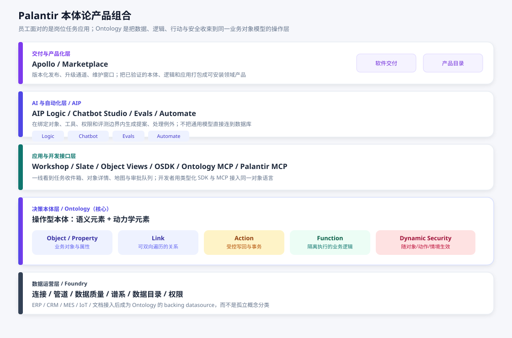
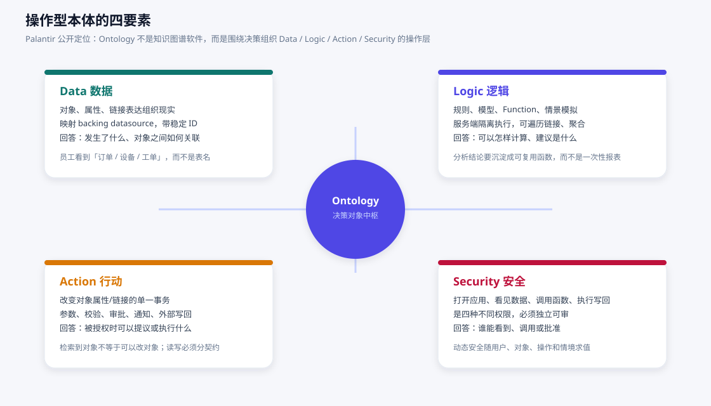
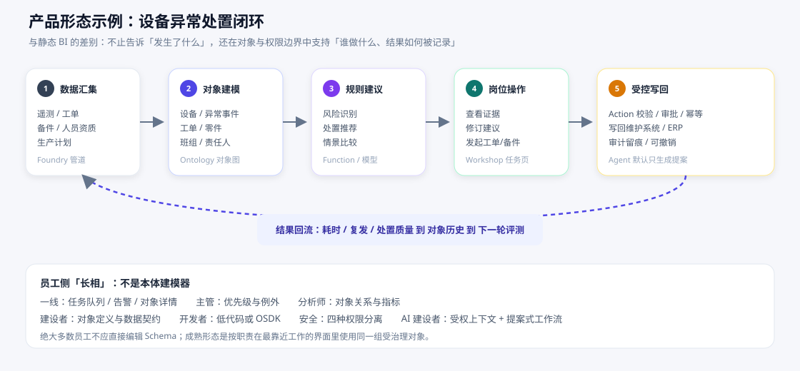
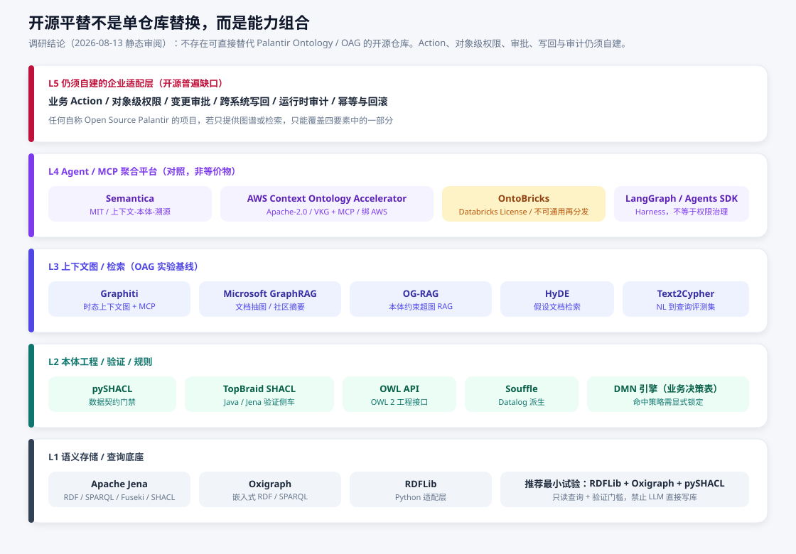
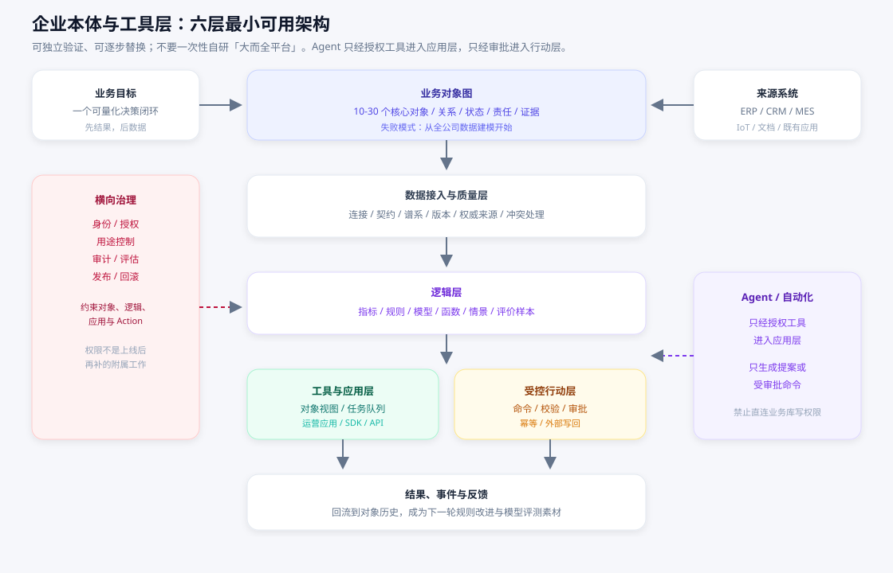
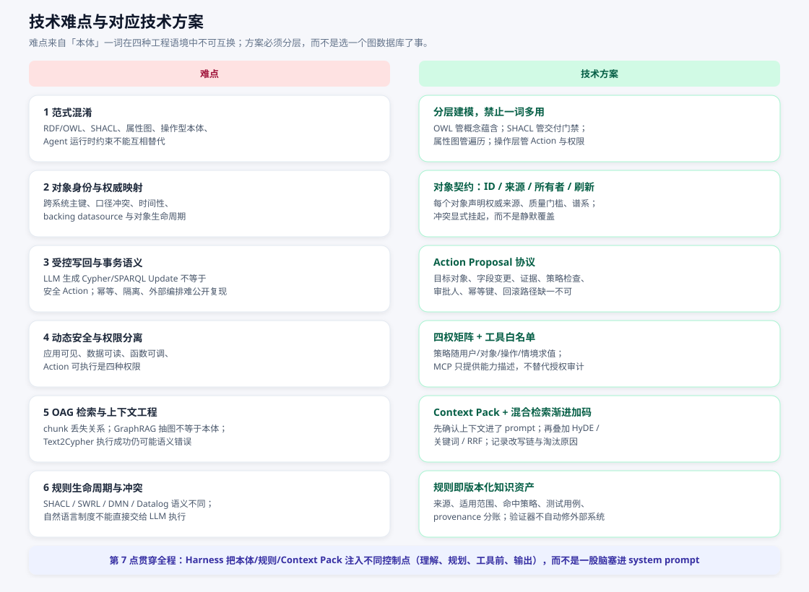
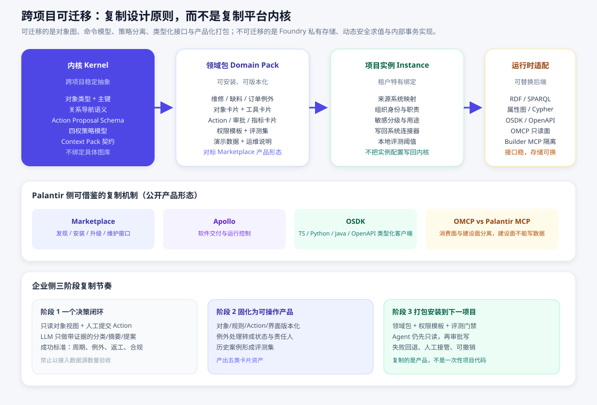

# 企业本体论产品调研报告

**副题：** Palantir 操作型本体、开源能力组合、企业自建难点与跨项目复制  
**基于仓库：** [DemonDamon/oag-deep-research](https://github.com/DemonDamon/oag-deep-research)（2026-08 第一轮与扩展调研）  
**成稿日期：** 2026-08-14  
**图示约定：** 全文架构图、闭环图、能力图均为 SVG，不使用 Mermaid。

---

## 这篇报告回答什么

企业谈「上本体 / 上知识图谱 / 上 Palantir」，经常把三件不同的事混在一起：语义 Web 里的形式本体、图数据库里的实体关系、以及 Palantir 那种把**数据、逻辑、行动、安全**绑在同一套业务对象上的运营平台。本报告只回答四个决策问题：

1. Palantir 的本体论相关产品究竟有哪些，员工实际面对的产品形态是什么。
2. 开源世界有哪些可对照的 GitHub 方案，哪些能补哪一层，哪些绝不是平替。
3. 企业若自建，真正难的工程点是什么，对应技术方案应落在哪一层。
4. 一套本体能力如何从试点项目迁到下一个项目，而不是每个部门重做一遍。

**证据边界（必须先读）：** Palantir 能力描述来自其公开产品文档与官方博客，可用性随版本、合同和租户权限变化。开源结论来自 2026-08-13 的 GitHub 页面 / LICENSE / 顶层目录静态审阅，**未安装依赖、未跑第三方代码、未连真实库**。星标是访问日快照，不能当作成熟度证明。Semantica 等项目自称 “Open Source Palantir” 是自我定位，不是技术等价证明。

---

## 1. Palantir 的本体论产品有哪些，产品形态如何

### 1.1 一句话

Palantir 并不单独卖一个「知识图谱」或一个「聊天机器人」。公开产品组合是：**Foundry 做数据运营，Ontology 做决策对象层，AIP 把生成式 AI 接到运营过程，Apollo / Marketplace 做软件与领域能力的交付。** 员工日常打开的，是岗位级运营应用，而不是本体建模器。

### 1.2 产品清单与形态

| 产品 / 能力 | 在组合中的位置 | 使用者实际看到的形态 |
|---|---|---|
| **Foundry** | 数据操作系统：连接、管道、质量、谱系、目录、权限 | 数据工程师接入 ERP / CRM / MES / 文档 / 传感器；分析师消费可信数据集 |
| **Ontology** | 位于数据集、虚拟表和模型之上的**操作层** | 业务人员看到「订单、客户、设备、工单」，应用和 API 使用同一套对象语言 |
| **Object / Property / Link** | 语义元素：类型、实例、字段、可双向遍历的关系 | 对象详情页、关系导航、对象集合筛选 |
| **Function** | 服务端隔离执行的业务逻辑（官方支持 TypeScript / Python） | 指标、推荐、情景模拟、聚合查询，而不是一次性 SQL |
| **Action** | 改变对象属性或链接的事务，可带参数、规则、校验、通知与外部写回 | 提交、分配、批准、升级；写回维护系统或 ERP |
| **Dynamic Security** | 随用户、对象、操作、情境生效的安全 | 「能打开应用 / 能看见数据 / 能调函数 / 能执行写回」四种权限分离 |
| **Workshop / Slate / Object Views** | 运营应用与对象视图 | 任务收件箱、告警、地图、共同运营态势、审批队列 |
| **AIP** | Logic、Chatbot Studio、Evals、Automate、模型服务 | 检索、摘要、草拟、分类、提案；建设者配置提示、工具与评测 |
| **OSDK** | TypeScript / Python / Java / OpenAPI 类型化客户端 | 开发者把 Ontology 当应用后端，纳入版本控制 |
| **Ontology MCP（OMCP）** | 面向消费者的 Agent 接入面 | 按应用暴露对象、预定义 Action 和查询 |
| **Palantir MCP** | 面向建设者的开发面 | 服务类型与开发流程；官方明确**不能写实际 Ontology 数据** |
| **Marketplace** | 领域能力的发现、安装、升级、维护窗口 | 把验证过的本体、逻辑、应用打包成可安装产品 |
| **Apollo** | 软件交付与运行控制 | 版本、发布通道、运维窗口 |

Gotham 等面向政府/防务的产品线不在本轮公开 Foundry/AIP 资料的主范围内，本报告不外推。

### 1.3 Ontology 为什么不是「再建一张图」

官方把 Ontology 拆成两类元素：

- **语义元素：** Object、Property、Link —— 回答「发生了什么、对象如何关联」。
- **动力学元素：** Action、Function、动态安全 —— 回答「可以怎样算、被授权时可做什么、谁能看/调/批」。

这解释了三个常见误解：

1. **不等于知识图谱。** 图结构只覆盖语义元素。没有状态、命令、权限、证据和生命周期，就还停在「能查关系」而不是「能决策」。
2. **不等于语义层或数据目录。** 目录解决「有哪些表」；Ontology 解决「订单这个对象现在归谁、允许哪些动作、写回哪套系统」。
3. **不等于 RAG。** Palantir 的 OAG（Ontology-Augmented Generation）是一套与对象、查询、行动接口耦合的**上下文工程策略**（分块、向量、HyDE、关键词、查询扩展、RRF 混合检索），不是某个专有 GraphRAG 算法。官方建议：上下文能装进窗口就先不要检索；检索失败先确认相关上下文是否真的进了 prompt，再逐步加机制。

### 1.4 员工怎样用：不是人人建本体

绝大多数员工不应编辑 Schema。成熟形态是按职责使用同一组受治理对象：

| 角色 | 日常动作 | 产品形态 |
|---|---|---|
| 一线运营 | 看任务、查告警、核实证据、提交或批准变更 | 任务应用、对象视图、受控 Action |
| 主管 / 调度 | 排优先级、跨团队协同、情景比较、例外升级 | 共同态势图、审批队列 |
| 分析师 | 探索关系、固化指标、验证假设 | 对象分析、可复用 Function |
| 数据 / 本体建设者 | 接入来源、定义对象与质量规则 | 管道、对象建模、数据契约 |
| 应用开发者 | 岗位应用或系统集成 | Workshop 低代码或 OSDK |
| AI 建设者 | 配置提案、工具、评测、观测 | AIP Logic / Chatbot / Evals；只读默认 |
| 安全 / 合规 | 身份、分级、用途、审批、审计 | 策略控制台；四权独立可审 |

一个可向管理层讲清楚的闭环是「设备异常处置」：遥测与工单进入 Foundry；Ontology 建成设备、事件、工单、零件、班组；规则给出建议；一线在 Workshop 里看证据并发起动作；有权限的 Action 写回 ERP；结果回到对象历史，供下一轮评测。

这与静态 BI 的差别不在图表是否好看，而在：**决策被记录在对象上，并且写回路径有权限、校验、审计和回流。**

### 1.5 对 Agent 的产品含义

AIP 应用可以使用 Ontology 数据与工具，但公开安全文档强调：生成、查询、提议、批准、提交是不同阶段。Palantir MCP 在本地第三方工具场景下，工具输出会发给对应 LLM 提供商；官方还声明不提供破坏性写工具，本体修改须经人工批准。对企业自建，这条原则可以直接搬： **Agent 默认只读；写必须表现为 Action Proposal。**

---

## 2. 开源的平替产品方案有哪些

### 2.1 选择结论

**不存在一个 GitHub 仓库可以替换 Palantir Ontology / OAG。** 可行路线是按能力组合：

语义存储 / 查询 **+** 本体工程 / 验证 / 规则 **+** 上下文图 / 检索 **+** Agent 聚合平台。  
业务 Action、对象级权限、变更审批、跨系统写回、运行时审计，仍然必须由领域适配层自建。

### 2.2 仓库清单（按承担角色，不是按星标排序）

星标为研究仓库 2026-08-13 快照，仅供体量直觉，不作质量评级。

#### A. 语义存储与查询底座

| 仓库 | 许可证（快照） | 适合承担 | 明确限制 |
|---|---|---|---|
| [apache/jena](https://github.com/apache/jena) | Apache-2.0 | RDF、SPARQL、Fuseki、SHACL、TDB，长寿命语义服务 | Java 生态重；须自建对象 / Action / 策略层 |
| [oxigraph/oxigraph](https://github.com/oxigraph/oxigraph) | Apache-2.0 或 MIT | 嵌入式 RDF / SPARQL，Python / JS / Rust 查询后端 | 权限与多租户需自测；项目仍在积极开发 |
| [RDFLib/rdflib](https://github.com/RDFLib/rdflib) | BSD-3-Clause | Python 侧 RDF 序列化、SPARQL、Store 适配 | 不是完整推理 / 验证 / 企业图服务 |

**最小试验建议：** RDFLib 建图 → Oxigraph 只读 SPARQL → pySHACL 做写入前验证。Jena / Fuseki 作为需要完整 Java 语义栈时的后续选项。

#### B. 本体工程、约束与规则

| 仓库 | 许可证（快照） | 适合承担 | 明确限制 |
|---|---|---|---|
| [RDFLib/pySHACL](https://github.com/RDFLib/pySHACL) | Apache-2.0 | SHACL Core / AF、RDFS/OWL-RL、规则扩展；数据契约门禁 | `owl:imports`、URL 输入、规则迭代必须设资源边界 |
| [TopQuadrant/shacl](https://github.com/TopQuadrant/shacl) | Apache-2.0 | Jena 栈的 SHACL `validate` / `infer` 侧车 | Java 21；导入与迭代规则有非终止风险 |
| [owlcs/owlapi](https://github.com/owlcs/owlapi) | README/POM 并列 LGPL-3.0 与 Apache-2.0，须逐模块复核 | OWL 2 解析、序列化、reasoner 接口 | 不是业务 Action 运行时 |
| [souffle-lang/souffle](https://github.com/souffle-lang/souffle) | UPL-1.0 | 递归 Datalog、派生关系、provenance / profiling | 算术函子扩展可能不终止；provenance ≠ 合规审计 |

规则表示不要混用：SHACL 管「当前数据是否符合契约」；SWRL 是 W3C Member Submission 而非 Recommendation，管蕴含规则；DMN 管可读业务决策表与命中策略；Datalog 管递归派生。把制度原文丢给 LLM「理解并执行」，会同时失去可判定性、冲突可见性和审计。

#### C. 上下文图与 OAG / RAG 实验基线

| 仓库 | 许可证（快照） | 适合承担 | 明确限制 |
|---|---|---|---|
| [getzep/graphiti](https://github.com/getzep/graphiti) | Apache-2.0 | Agent 时态上下文图：episode 来源、当前/历史事实、混合检索、MCP 参考 | 不提供已核验的企业权限与 Action 语义 |
| [microsoft/graphrag](https://github.com/microsoft/graphrag) | MIT | 文档 → 图 → 社区摘要；Local / Global / DRIFT | 官方声明是方法演示而非正式支持产品；抽图 ≠ 领域本体 |
| [microsoft/ograg2](https://github.com/microsoft/ograg2) | MIT | 本体约束超图 RAG、评测脚本 | 论文配套实验，不能承诺生产性能 |
| [texttron/hyde](https://github.com/texttron/hyde) | 论文实现 | HyDE：假设文档检索 | 假设文本不得进入证据库 |
| [neo4j-labs/text2cypher](https://github.com/neo4j-labs/text2cypher) | CC0-1.0 | NL → Cypher 数据集与离线评测 | 不是生产查询服务；执行成功 ≠ 语义正确 |
| [neo4j/neo4j](https://github.com/neo4j/neo4j) | 发行许可须按版本核对 | 属性图与 Cypher 对照实验 | 不能替代形式语义互操作或业务写回治理 |

OAG 与这些项目的关系：OG-RAG 是最接近「本体增强检索」的公开研究对照；GraphRAG 解决的是非结构化文本的图记忆；Graphiti 解决的是带时间窗的 Agent 记忆。三者都覆盖不了 Palantir 的 Action / 动态安全。

#### D. 面向 Agent 的聚合平台（对照架构，禁止当等价物）

| 仓库 | 许可证（快照） | 适合承担 | 明确限制 |
|---|---|---|---|
| [semantica-agi/semantica](https://github.com/semantica-agi/semantica) | MIT | 覆盖面最完整的「上下文—本体—决策溯源」对照：ingest、ontology、reasoning、PROV-O、MCP / REST | 功能广、依赖面大；README 声明须按源码逐项验证 |
| [aws/context-ontology-accelerator](https://github.com/aws/context-ontology-accelerator) | Apache-2.0；含 AGPL/LGPL 依赖 | 形式化本体、虚拟知识图谱、SPARQL federation、MCP、云部署架构对照 | 绑 AWS（Neptune / OpenSearch / Bedrock）；持续开发主分支；云成本 |
| [databrickslabs/ontobricks](https://github.com/databrickslabs/ontobricks) | **Databricks License** | Unity Catalog → R2RML → 物化图谱 → GraphQL / MCP；领域版本 DRAFT / IN-REVIEW / PUBLISHED | **不适合作为通用可再分发依赖**；只作受限平台评估 |

#### E. Agent Harness、评测与观测（本体要「进运行时」才有约束力）

| 仓库 | 作用 | 不要误解为 |
|---|---|---|
| [langchain-ai/langgraph](https://github.com/langchain-ai/langgraph) | 图状态、checkpointer / store、人工介入 | 图编排 = 权限治理 |
| [openai/openai-agents-python](https://github.com/openai/openai-agents-python) | 工具循环、handoff、输入/输出/工具 guardrail、tracing | 框架默认 = 安全保证 |
| [modelcontextprotocol/specification](https://github.com/modelcontextprotocol/specification) | Host / Client / Server、Tools 同意原则 | MCP 自动完成逐工具授权 |
| [NVIDIA/NeMo-Guardrails](https://github.com/NVIDIA/NeMo-Guardrails) | 对话与工具护栏参考 | 可替代对象级权限 |
| [explodinggradients/ragas](https://github.com/explodinggradients/ragas) | 检索相关性、忠实性、回答质量 | 可替代业务结果指标 |
| [openai/evals](https://github.com/openai/evals) | 离线回归与工具调用评估骨架 | 上线即生产认证 |
| [langfuse/langfuse](https://github.com/langfuse/langfuse) | trace、dataset、experiment、CI 回归门禁 | 可上传敏感生产轨迹 |

### 2.3 推荐组合（按目标，而不是「选一个最像 Palantir 的」）

| 目标 | 首选组合 | 明确排除 |
|---|---|---|
| 可审计实体关系检索 | RDFLib + Oxigraph + pySHACL | LLM 生成的查询直接写入业务库 |
| 时间化 Agent 记忆 | Graphiti + 自建政策 / 审计适配层 | 因 README 有 MCP 就跳过认证与租户审查 |
| 文档知识图谱研究 | GraphRAG 或 OG-RAG + 主张账本 | 把抽图结果升格为事实 |
| 规则化决策建议 | pySHACL / TopBraid + 领域 Action Proposal Schema | 验证器自动改外部系统 |
| 全栈原型对照 | Semantica（优先）或 AWS Accelerator（仅架构） | 未审依赖、密钥、云资源就运行 |
| Databricks 语义层评估 | OntoBricks（受限平台） | 纳入通用 Apache / MIT 依赖或再分发 |

### 2.4 Palantir 自己开源的，是 SDK，不是平台替代

这些仓库适合研究「类型化对象查询 / Action 调用」的接口形态，**不是 Foundry 服务端**：

- [palantir/osdk-ts](https://github.com/palantir/osdk-ts)
- [palantir/foundry-platform-python](https://github.com/palantir/foundry-platform-python)
- [palantir/foundry-platform-typescript](https://github.com/palantir/foundry-platform-typescript)
- [palantir/ontology-starter-react-app](https://github.com/palantir/ontology-starter-react-app)

对自建的启发是：对外暴露稳定的对象、链接、查询、命令 Schema，而不是让每个项目直接打图数据库。

---

## 3. 企业如何构建本体论产品：难点与技术方案

### 3.1 建设目标先改口

不要把目标写成「上线一个本体平台」或「接入 N 个数据源」。应写成：**缩短并改善一个关键决策闭环**。先选范围有限、高频、跨系统、能衡量、存在明确操作回路的用例（维修工单分流、缺料风险、大客户订单例外、质量偏差调查）。成功标准是决策时长、例外闭环率、返工、合规遗漏、批准后结果，而不是实体数或三元组数。

### 3.2 六层最小可用架构

把能力拆成可独立验收、可逐步替换的层，而不是一次性采购或自研「大而全」。

| 建设层 | 必须先回答 | 最小交付物 | 常见失败 |
|---|---|---|---|
| 业务对象图 | 哪些实体、状态、关系真正决定结果？谁拥有定义？ | 10–30 个核心对象、主键 / 来源 / 状态、关系、词汇表 | 从全公司数据建模开始 |
| 数据与质量 | 权威来源、刷新规则、质量门槛是什么？ | 映射、契约、质量检查、谱系、异常处理 | 只汇总、不记录口径与冲突 |
| 逻辑 | 什么规则 / 模型 / 人工判断影响该决策？ | 指标定义、规则版本、函数契约、评价样本 | 自然语言制度直接交给 LLM 执行 |
| 工具与应用 | 谁在何时看什么、做什么？ | 一个岗位应用、对象视图、任务队列、拒绝路径 | 只交付只读看板 |
| 行动与集成 | 哪些操作允许改变内外部系统？ | 命令目录、参数 Schema、校验、审批、幂等键、审计 | Agent 直接拿数据库 / ERP 写权限 |
| 治理与交付 | 谁可看、可建议、可批准、可执行？如何发布回滚？ | 权限矩阵、审计策略、评测集、版本 / 回滚 | 把权限和评测当成上线后的附属工作 |

### 3.3 七个技术难点，以及不该用的「捷径」

**难点 1：范式混淆。**  
「本体」在 RDF/OWL（可交换形式语义）、SHACL（当前数据是否符合形状）、属性图 Schema（节点/边/索引）、Palantir 操作型本体（对象 + 命令 + 安全）、Agent 运行时约束（工具 Schema 与审批）里指五件不同的事。它们可互补，**不能互换**。  
**方案：** 概念对齐用 OWL / 受控词表；交付与写入前用 SHACL；高频遍历可用属性图；运营决策必须另建对象 / Action / 策略层。不要指望「上 Neo4j」自动得到 Palantir。

**难点 2：对象身份、权威来源与冲突。**  
对象类型必须映射 backing datasource，而不是孤立概念分类。跨 ERP / MES 的「同一设备」往往主键不同、刷新节奏不同、口径冲突。  
**方案：** 每个对象强制字段：稳定 ID、类型、权威来源、所有者、更新规则、数据契约、谱系。冲突显式进入未决队列，禁止静默覆盖。质量规则通过率进入发布门禁。

**难点 3：受控写回。**  
Action 在 Palantir 里是「按用户定义逻辑改变一个或多个对象」的单一事务，可含自动建链、通知、授权验证；写入成为 writeback 并反映到相关应用。开源图库几乎都不提供这套语义。把「LLM 生成一条 Update」当成 Action，会在并发、幂等、部分失败、外部系统补偿上同时崩。  
**方案：** 任何写都表达为 **Action Proposal**：目标对象、字段变更、理由、证据、策略检查结果、审批人、幂等键、回滚路径。先人工批准，再由受控工作流提交。Agent 不得持有生产写账号。

**难点 4：动态安全。**  
Workshop 文档把模块访问与对象、Action、Function 权限分开。能打开页面 ≠ 能看见全部对象 ≠ 能调函数 ≠ 能写回。公开资料不足以复现 Palantir 的策略冲突次序与求值性能，但这条**产品原则**必须自建。  
**方案：** 四权矩阵（应用 / 数据 / 函数 / Action）+ 用途控制 + 最小权限工具白名单。MCP 只做能力协商和调用前同意，Host / 网关必须补身份、受众、作用域、审批、审计。输入 / 输出 / 工具三层 guardrail 要分开挂载：只做首尾文本检查，拦不住中间工具副作用。

**难点 5：OAG 检索。**  
传统 RAG 的上下文单位是 chunk，会丢掉跨段关系；GraphRAG 的抽图没有领域类型约束；HyDE 的假设文档不能当证据；Text2Cypher 即使执行成功也可能问错对象。本体覆盖率不足时，「OAG」会退化成更贵的 RAG。  
**方案：** 每轮回答固化为 **Context Pack**：原问、改写链、schema linking、候选来源 ID、重排分数、淘汰原因、最终上下文、主张、引用、验证状态。检索从简到繁：能塞进窗口就不检索 → 分块 + 向量 → 关键词补专名 → 必要时 HyDE / 查询扩展 → RRF 融合。结构化查询走白名单与只读账号；生成查询默认「生成但不执行」。

**难点 6：规则生产与冲突。**  
从制度文档抽出的句子还不是可执行规则。SHACL 失败、DMN 命中、Datalog 派生的审计形态完全不同。Soufflé 的 provenance 服务调试，不能直接当合规证明。  
**方案：** 规则先作为来源绑定的知识资产：`rule_id`、版本、作者 / 审批人、出处定位、自然语言原文、结构化表达、适用范围与有效期、优先级与冲突集、测试用例。管道上用 SHACL 做输入 / 输出门禁；业务决策用 DMN 显式命中策略；派生关系用 Datalog。验证器返回 `conforms`、违规路径、规则 ID，**不自动修复外部系统**。

**难点 7：Harness 注入点错误。**  
把本体全文、规则全文、检索结果一股脑塞进 system prompt，既撑爆上下文，也没有控制点。LangGraph 还提醒：线程内可恢复状态（checkpointer）和跨线程长期记忆（store）权限、保留期、审计要求不同。  
**方案：** 本体进入「任务理解 / 检索」；规则进入「规划与工具前校验」；Context Pack 进入「回答与主张验证」；Action 使用独立工具 Schema。轨迹要区分调试临时内容、不可抵赖审计事件、需最小化的用户内容。

### 3.4 三阶段实施，而不是「先做大本体工程」

**阶段 1 — 一个闭环。** 只读对象视图 + 人工提交 Action。LLM 只生成带证据链接的分类 / 摘要 / 提案。不写生产系统。

**阶段 2 — 固化成产品。** 把稳定下来的对象、质量检查、规则、Action、任务界面版本化。分析师的临时结论变成指标或规则；一线例外变成结构化状态与责任人。形成五类资产：对象卡片、工具卡片、Action 卡片、审批卡片、指标卡片。用真实历史案例做评测集。

**阶段 3 — 产品化后再扩 Agent。** 封装为可安装领域包（见第 4 节）。Agent 角色顺序：解释、检索、草拟、分流、提案、低风险只读工具 → 有审批的 Action。自动执行必须有适用范围、失败回退、人工接管、审计和可撤销方案。

### 3.5 怎样判断「本体真的赋能了」

不要统计实体数、三元组数、数据源数、模型调用数。至少同时看五组指标：

| 指标组 | 示例 |
|---|---|
| 业务结果 | 决策时长、例外闭环率、停机 / 缺货 / 返工、按时履约 |
| 数据可信度 | 核心对象覆盖率、质量规则通过率、谱系完整度、延迟、冲突未决率 |
| 工具采用 | 目标岗位覆盖率、任务完成率、人工覆盖 / 撤销率 |
| AI 质量 | 有证据提案比例、幻觉 / 无权限工具调用率、评测漂移 |
| 治理 | 越权阻断率、审批留痕率、审计可追溯率、回滚成功率 |

发布闸门应对齐 NIST AI RMF 的 Govern / Map / Measure / Manage：有责任主体、风险映射、量化门槛、升级路径。检索型能力可用 RAGAs / ARES 做离线门禁，但 LLM-as-Judge 必须用人工抽样校准。能调工具的技能还要覆盖：检索失败、提示注入、权限拒绝、非法参数、幂等重试、超时、敏感泄露、人工审批。

---

## 4. 本体论产品如何在不同项目下可迁移复制

### 4.1 先分清：复制设计原则，不复制平台内核

公开资料不足以复现 Foundry 的内部事务、存储、动态安全求值或性能。因此「可迁移」指的是五层抽象，而不是把产品名、API 或安全机制当成开放标准：

1. 带明确类型、键、来源、版本的业务对象图  
2. 只读查询与关系导航  
3. 可验证、可幂等、带副作用声明的业务命令  
4. 随用户 / 对象 / 操作 / 情境变化的策略  
5. 由 SDK / Schema / MCP 对外暴露的类型化接口  

下一项目要带走的是这五层的**契约与领域包**，不是上一项目的管道脚本和图数据库物理模型。

### 4.2 四个可复制单元

| 单元 | 跨项目是否稳定 | 里面放什么 | 禁止放什么 |
|---|---|---|---|
| **内核 Kernel** | 稳定 | 对象元模型、Action Proposal Schema、四权模型、Context Pack 字段、主张账本 | 某个客户的表名、账号、连接串 |
| **领域包 Domain Pack** | 按行业 / 场景复制 | 10–30 个对象定义、规则、岗位应用模板、权限模板、评测集、演示数据、运维说明 | 租户特有映射 |
| **项目实例 Instance** | 每个项目一份 | 来源系统映射、组织身份、敏感分级、写回连接器、本地阈值 | 反向污染内核 |
| **运行时适配 Adapter** | 可替换 | RDF/SPARQL、属性图、OSDK、只读 OMCP | 把存储引擎 API 泄漏给业务应用 |

这与 Palantir Marketplace「安装一个领域能力」是同一产品思想：验证过的本体、逻辑、应用按版本安装、升级、设维护窗口。OntoBricks 把领域版本做成 DRAFT / IN-REVIEW / PUBLISHED、外部 API 只服务已发布版本，也是同一类可复制机制，只是许可证把它锁在 Databricks 内。

消费面与建设面必须分开，这是跨项目复制时最容易塌掉的一点：Ontology MCP 给 Agent 消费对象和预定义 Action；Palantir MCP 给建设者改类型，且不能写数据。自建时若把「本体 MCP」做成既能改 Schema 又能写对象，下一个项目的 Agent 会直接打穿治理。

### 4.3 可移植接入契约（Skill / 服务 / 领域包共用）

每个要迁到下一项目的能力，至少带这些字段，否则无法回滚、无法评测、无法审计：

| 字段 | 目的 |
|---|---|
| `id` / `version` / `owner` | 识别、追踪、回滚 |
| 输入 / 输出 Schema | 防止自然语言接口无限扩张 |
| 证据资产版本与来源策略 | 未核验内容不进权威上下文 |
| 工具白名单、权限范围、审批条件 | 约束可执行行为 |
| 数据分类、日志策略、保留期 | 隐私与审计 |
| 超时、重试、幂等、回滚 | 约束副作用和成本 |
| 离线评测集与发布阈值 | 回归门禁 |

上线前跑离线 eval，上线后同时看质量、成本、安全。观测可以用 Langfuse 这类开源，但不要把敏感生产 trace 或无权分发的研究资料传出去。

### 4.4 复制时的工作顺序（可当 checklist）

1. **冻结内核契约**（对象元模型、命令 Schema、四权、Context Pack），用 JSON Schema / OpenAPI / SHACL 表达，而不是 Wiki。  
2. **从已验证闭环抽领域包**，不要从「企业总本体」抽。第一个包就应该能在空租户里用演示数据跑通对象视图 + 人工 Action。  
3. **实例化时只改映射与策略**，不改对象语义。若必须改语义，升级领域包版本，而不是在项目里 fork 一份对象定义。  
4. **适配器对准内核接口**。换 Oxigraph 为 Jena、或加一条属性图只读通道，不应迫使岗位应用改代码。  
5. **评测集随包走。** 没有历史案例和阈值的领域包，等于没有验收的一次性项目。  
6. **Agent 后置。** 先复制对象和 Action，再复制只读工具，最后才考虑有审批的自动执行。

### 4.5 跨项目最常见的四种复制失败

1. **复制了图谱，没复制命令。** 下一项目能查关系，但不能受控写回，于是又退回聊天机器人。  
2. **复制了 prompt，没复制权限。** 模型换了、租户换了，越权工具调用率立刻上升。  
3. **把实例映射写进内核。** 第一个客户的 ERP 字段名变成「标准本体」，第二个客户无法安装。  
4. **用厂商能力目录替代路线图。** 商业平台、开源组合还是混合架构，应由场景临界性、现有系统、数据成熟度、安全要求、工程能力、交付节奏和 TCO 共同决定。公开资料推不出「必须买某家」或「必须全自研」。

---

## 给决策者的收口

- Palantir 的本体论产品形态，是 **Foundry + Ontology + AIP + Apollo/Marketplace** 组成的决策操作系统；员工看到的是任务应用，本体是底下那层对象语言。  
- 开源侧没有平替仓库。能立刻动手的组合是 **RDFLib + Oxigraph + pySHACL** 做只读对象图与契约，**Graphiti / GraphRAG / OG-RAG** 做检索实验，**Semantica 或 AWS Accelerator** 只作架构对照；Action、四权和写回必须自建。  
- 企业构建的难点不在「选 Neo4j 还是 Jena」，而在对象身份、受控写回、权限分离、上下文可审计、规则版本化、Harness 注入点。  
- 跨项目复制的单位是 **内核契约 + 领域包 + 实例映射 + 可替换适配器**，再配评测门禁与消费/建设面分离。复制成功的标志，是下一个项目能在一周内装上同一领域包、接上自己的来源系统、用同一套 Action 和权限矩阵跑通闭环——而不是再画一张更大的企业本体图。

---

## 主要依据（均来自本仓库已审核笔记）

- `research/02-palantir-ontology-platform/DEEP_RESEARCH.md`  
- `research/02-palantir-ontology-platform/deliverables/palantir-product-shape-and-user-workflows.md`  
- `research/02-palantir-ontology-platform/deliverables/palantir-ontology-oag-expanded-research.md`  
- `research/01-foundations-and-paradigm-boundaries/DEEP_RESEARCH.md`  
- `research/03-oag-retrieval-and-context-engineering/DEEP_RESEARCH.md`  
- `research/04-rules-reasoning-and-knowledge-production/DEEP_RESEARCH.md`  
- `research/05-agent-harness-and-runtime-governance/DEEP_RESEARCH.md`  
- `research/06-evaluation-selection-and-case-studies/DEEP_RESEARCH.md`  
- `research/06-evaluation-selection-and-case-studies/deliverables/ontology-open-source-tool-landscape.md`  
- `research/06-evaluation-selection-and-case-studies/deliverables/enterprise-ontology-and-tooling-roadmap.md`

公开文档入口（核验产品细节时以官网当前版为准）：

- [Platform overview](https://palantir.com/docs/foundry/platform-overview/overview/)  
- [The Ontology system](https://palantir.com/docs/foundry/architecture-center/ontology-system/)  
- [Ontology-augmented generation](https://palantir.com/docs/foundry/ontology/ontology-augmented-generation/)  
- [Action types](https://palantir.com/docs/foundry/action-types/overview/)  
- [Ontology SDK](https://palantir.com/docs/foundry/ontology-sdk/overview/)  
- [Workshop overview](https://palantir.com/docs/foundry/workshop/overview/)  
- [Marketplace overview](https://palantir.com/docs/foundry/marketplace/overview/)  
- [Connecting Agents to Decisions](https://blog.palantir.com/connecting-agents-to-decisions-277dee8ddb40)
