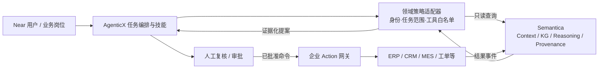

# Semantica 深度静态代码审阅：上下文、本体、决策溯源与 Agent 集成边界

> **审阅范围。** 本文基于对 `semantica-agi/semantica` 的公开源码、内置文档、公开仓库页面及 DeepWiki 索引的静态阅读撰写；未安装依赖、未启动服务、未运行测试、未导入第三方代码，也未对安全性、性能、正确性或生产适用性作认证。本文将“项目公开主张”“源码中可观察到的结构”和“推荐集成方式”明确区分。

## 结论摘要

Semantica 是一个面向 Agent 上下文、决策记录、知识图谱、本体管理、规则推理与证据溯源的 Python 平台型项目。它的定位不是替代 LLM 或单一向量数据库，而是把原始资料经抽取、冲突处理、实体解析和图构建后，发展为可查询的 Context Graph / Knowledge Graph，并在其上连接 OWL/SHACL、推理、PROV-O、决策记录、向量检索、MCP、REST、CLI 和可视化能力。[1] [2]

对于本仓库所研究的“Palantir 式本体 + OAG + AgenticX/Near”路径，Semantica 的价值不在于做 Palantir 的一比一开源替代，而在于提供若干可独立试用的**能力层**：本体/约束、实体与关系抽取、知识图谱、决策溯源、确定性规则、GraphRAG 上下文和 MCP 适配。它不自动补齐企业级数据治理、业务对象权威定义、身份权限体系、审批流程、领域规则所有权和产品交付治理；这些仍需由企业自身的本体与工具层承担。

## 版本、来源与审阅方法

| 项目 | 本次记录 |
|---|---|
| 代码来源 | [`semantica-agi/semantica`](https://github.com/semantica-agi/semantica) |
| 本地固定源码 | `94d0c3dc07109fb4e6df3027dbd571eeefc45d52`，2026-08-14，提交信息为 `fix(kg): remap relationship endpoints after entity resolution (#978)` |
| 可见社区快照 | 约 **7.2k stars**、752 forks、2,319 commits；以 2026-08-14 公开仓库页面为准，随时间变化。[1] |
| 许可证 | MIT；项目元数据声明 Python `>=3.8`，当前包版本 `0.6.5`。[3] |
| DeepWiki 参考 | 索引于 `e90bd048`、显示最后索引日为 2026-08-08；早于本次固定源码，因此只作为导航和二级解释，源码与官方仓库文档优先。[4] |
| 本地资产路径 | `/home/ubuntu/oag-research-assets/github-tools/semantica-agi-semantica`；未将第三方源码复制到本公共研究仓库 |

## 一、项目实际形态：不是单一“本体库”

源码自带的架构文档把处理链路描述为：多源接入 → 解析 → 规范化 → 切分 → 语义抽取 → 冲突检测 → 去重/实体合并 → 知识图谱 → 本体、推理、溯源与决策上下文 → 向量/图存储 → 导出、可视化、REST、MCP 与 CLI。[2] 这说明 Semantica 的代码组织横跨数据工程、知识建模、推理、Agent 上下文和接口层，适合按模块试验，而不应被当作“安装一个包即可得到企业本体平台”。

| 能力层 | 观察到的源码/文档模块 | 对企业本体与 OAG 的意义 | 不应据此假定的能力 |
|---|---|---|---|
| 接入与处理 | `semantica.ingest`、`parse`、`normalize`、`split`、`semantic_extract` | 将文件、网页、表格、数据库等资料转为可抽取的输入；支持面向实体/关系的切分 | 自动获得权威数据、正确字段口径或合规授权 |
| 图构建与质量 | `kg`、`conflicts`、`deduplication`、`graph_store` | 实体解析、冲突标记、关系构建和多后端图存储是建立可用本体层的基础 | 冲突已被业务正确裁决，或实体合并一定准确 |
| 语义与逻辑 | `ontology`、`reasoning`、`triplet_store`、`provenance` | 对接 OWL、SHACL、SKOS、Rete、Datalog、SPARQL 与 W3C PROV-O | 规则适合自动执行业务动作，或模型输出天然符合制度 |
| Agent 上下文与决策 | `context`、`context.decision_*`、`vector_store` | 将实体、关系、决定、理由、因果关系、时间与先例查询转为可访问上下文 | 单个 `ContextGraph` 即代表高可用、跨租户、持久化的生产记忆系统 |
| 接口与使用形态 | CLI、REST、Explorer、MCP、`integrations` | 可用作人类浏览、程序集成或 Agent 工具调用的边界层 | 接口本身已实现企业级身份、授权、审计和变更审批 |

## 二、源代码核验的关键实现信号

### 1. Context Graph 是核心抽象，但默认实现应被当作可替换组件

`semantica/context/context_graph.py` 的文件说明将 `ContextGraph` 描述为**内存中的 GraphStore 实现**，包含节点/关系、邻居发现、类型索引、图导出和决策跟踪集成；节点与边具有 `valid_from` / `valid_until` 字段，代码对 ISO 时间输入做规范化和活动性判断。[5] 对 AgenticX/Near 而言，它很适合作为“可说明的会话/任务上下文”原型和决策轨迹抽象。

但“内存实现”同时意味着生产化时必须明确数据生命周期、持久化后端、并发、租户隔离、备份、删除权和审计留存。不能仅因接口名为 `ContextGraph` 就假定这些非功能性要求已经满足。

### 2. 决策被建模为图对象，而非只做日志

项目 README 与架构文档将 `record_decision()`、因果关系、先例检索、影响分析、规则检查和审计导出作为决策智能生命周期的一部分。[2] [6] 这与本仓库的 OAG 主张账本具有直接互补性：本仓库定义研究中的“主张—证据—推断—行动边界”，Semantica 的 Context / Provenance 模块可作为实现“决定—理由—证据—影响”图谱的候选基础设施。

必须区分的是：源码可见的“记录、查询和导出”能力，不等同于企业的决策政策或责任机制。谁有权形成结论、谁能批准、何种情况下允许写回外部系统，仍需由外层业务流程和授权模型定义。

### 3. 本体、约束与推理能力具有明确模块边界

项目文档将 `semantica.ontology` 描述为 OWL 生成、SHACL 验证和 SKOS 词表能力，并列出 Rete、Datalog、SPARQL 和可解释推理模块。[6] 在 `pyproject.toml` 中，SHACL 是可选依赖（`pyshacl`）；因此以 SHACL 作为生产门禁前，应将依赖锁定、规则测试和失败处理纳入部署清单。[3]

README 还明确提示一个重要限制：Rete 引擎的 alpha-node 条件匹配在当前版本有意保持简单，接入实际规则集前应验证 `match_patterns()` 输出。[6] 这正符合本仓库的原则：规则引擎可辅助约束与解释，但不应跳过领域验证后直接驱动高风险 Action。

### 4. MCP 存在两个层面的实现，适合先做最小权限适配器

本地源码包含包内 `semantica.mcp_server` 和顶层 `mcp/` 目录。此次阅读的顶层 `mcp/server.py` 是一个通过 stdio 处理 JSON-RPC 2.0 的 MCP 服务：支持 `initialize`、`tools/list`、`tools/call`、`resources/list`、`resources/read` 和 `ping`；工具由 `mcp.tools.TOOL_DEFINITIONS` 汇总，分类覆盖 extraction、decisions、graph、reasoning、export。[7] [8]

从已审阅的这一包装层可见，工具调用被直接分派给工具处理器；该层未展示面向多用户客户端的独立认证/逐工具授权逻辑。应把它理解为本地进程边界内的 MCP 接口，而不是企业权限系统。若接入 AgenticX/Near，建议以**受控适配器**包裹：只暴露白名单工具、将操作按只读/写入分类、校验输入 Schema、绑定租户/用户身份、记录 trace，并把任何外部写回放入审批队列。

### 5. 依赖与部署面不小，应避免“一键 all”进入生产

`pyproject.toml` 的核心依赖包括 NumPy、Pandas、PyTorch、Transformers、spaCy、FAISS、RDFLib、NetworkX、GitPython、文档解析与图像/音频处理库；图存储、向量存储、LLM、云、监控、Explorer、SHACL 等为多组可选依赖，并提供 `semantica`、`semantica-server`、`semantica-worker`、`semantica-explorer`、`semantica-mcp` 等入口。[3] 这说明它更接近可组合的平台型仓库，而非轻量嵌入式 SDK。

推荐通过最小能力切片试验：例如先选择 `ontology + shacl + provenance + context + mcp`，再根据明确需求加入特定图/向量后端。不要为了演示一次性安装 `all` extra，更不要将本地开发默认配置直接暴露至外网。

## 三、与 Palantir 模式的对应与差异

| 维度 | Palantir 模式（概念层） | Semantica 可贡献的部分 | 企业仍需自建/选型的部分 |
|---|---|---|---|
| 业务对象 | 运营型业务对象、链接、状态、行动与安全的共同层 | 本体生成、KG、实体解析、时态/溯源数据结构 | 领域词汇权威、对象所有者、状态机、主数据治理 |
| 数据到知识 | 受治理数据接入、谱系、对象映射 | 多源接入、抽取、冲突/去重、KG 与 PROV-O | 数据合同、质量 SLA、数据分级、同意与用途控制 |
| 逻辑 | Function、模型、规则与分析 | Rete/Datalog/SPARQL、SHACL、因果/先例查询 | 正式规则库、测试覆盖、责任签字、模型风险治理 |
| 运营行动 | 权限化 Action、审批、外部系统写回 | 可为决策上下文和工具调用提供证据/规则服务 | 命令 API、幂等、审批、撤销、任务编排、SoD 权限 |
| AI/Agent | 受权上下文、工具、评测、人工复核 | Context Graph、决策记录、MCP、图/向量检索 | Prompt/工具策略、执行权限、红队、Evals、观测、事故响应 |
| 平台交付 | 产品化安装、升级、运维、跨组织推广 | MIT 组件可嵌入或二次开发 | 发布/升级策略、租户隔离、SRE、安全运营、服务合同 |

## 四、建议的 AgenticX/Near 接入方式

不要把 Semantica 直接等同于 AgenticX/Near 的全局记忆或权限中枢。建议使用一个版本化的领域适配器，使 AgenticX 保持任务编排和用户交互职责，Semantica 专注于可验证的知识/上下文能力。

| 阶段 | Semantica 的建议用法 | 禁止或延后事项 | 验收标准 |
|---|---|---|---|
| 0：离线评估 | 用固定语料建立对象、关系、证据和冲突样本；验证 SHACL/规则/查询 | 不连生产系统，不接入真实密钥 | 来源可追溯、规则失败可解释、测试案例可复现 |
| 1：只读助手 | 暴露图查询、证据检索、先例查找和审计摘要等 MCP 只读工具 | 不开放 export/import、写入、管理员操作 | 每次回答携带来源/对象 ID；越权和注入样本被拒绝 |
| 2：提案式协作 | 记录决策草稿、因果链和候选政策检查结果 | Agent 直接写回生产对象或外部 API | 人工审批率、证据覆盖率、错误归因与撤销路径可测 |
| 3：受控行动 | 通过企业 Action 网关执行低风险、幂等、可回滚操作 | 直接授予 MCP 进程广泛凭据 | Action 参数校验、最小权限、双重审批、审计/回放、回滚演练完成 |

## 五、与当前仓库资产的归档关系

Semantica 的首要归属为 [`05-agent-harness-and-runtime-governance`](../README.md)，因为其最有价值的差异化部分是 Agent Context、决策记录、MCP、规则、溯源和运行时责任链。它也应被从以下方向交叉引用：

- `02-palantir-ontology-platform`：比较“运营型本体”与 OWL/SHACL/KG 基础设施的职责边界；
- `03-oag-retrieval-and-context-engineering`：评估 GraphRAG、实体/关系感知切分、图/向量混合检索；
- `04-rules-reasoning-and-knowledge-production`：验证 SHACL、Rete、Datalog 与解释链；
- `06-evaluation-selection-and-case-studies`：比较集成成本、社区成熟度、依赖面、安全边界和可替换性。

## 六、下一轮需要补证的事项

1. 对包内 `semantica.mcp_server` 与顶层 `mcp/` 的配置、存储、工具处理器、资源权限和异常处理做更细粒度的安全与接口审阅。
2. 用无敏感数据的最小语料运行安装、SHACL 验证、规则匹配、实体解析、PROV-O 导出和 MCP 只读调用的可复现实验；本次未运行。
3. 验证 `ContextGraph` 与选定持久化图/向量后端的持久化、并发、事务、时态与多租户语义，不能由内存实现的接口推断。
4. 为 AgenticX/Near 确认真实的 MCP 生命周期、用户身份传递、工具授权、日志、版本锁定和桌面端沙箱边界。
5. 对依赖 SBOM、许可证兼容性、漏洞公告、供应链签名、生产网络暴露和密钥管理执行单独安全评估。

## 参考资料

[1] [Semantica GitHub repository](https://github.com/semantica-agi/semantica)

[2] [Semantica, `ARCHITECTURE.md` at reviewed revision](https://github.com/semantica-agi/semantica/blob/94d0c3dc07109fb4e6df3027dbd571eeefc45d52/ARCHITECTURE.md)

[3] [Semantica, `pyproject.toml` at reviewed revision](https://github.com/semantica-agi/semantica/blob/94d0c3dc07109fb4e6df3027dbd571eeefc45d52/pyproject.toml)

[4] [DeepWiki, *semantica-agi/semantica*](https://deepwiki.com/semantica-agi/semantica)

[5] [Semantica, `context_graph.py` at reviewed revision](https://github.com/semantica-agi/semantica/blob/94d0c3dc07109fb4e6df3027dbd571eeefc45d52/semantica/context/context_graph.py)

[6] [Semantica, `README.md` at reviewed revision](https://github.com/semantica-agi/semantica/blob/94d0c3dc07109fb4e6df3027dbd571eeefc45d52/README.md)

[7] [Semantica, top-level MCP server at reviewed revision](https://github.com/semantica-agi/semantica/blob/94d0c3dc07109fb4e6df3027dbd571eeefc45d52/mcp/server.py)

[8] [Semantica, MCP tool registry at reviewed revision](https://github.com/semantica-agi/semantica/blob/94d0c3dc07109fb4e6df3027dbd571eeefc45d52/mcp/tools/__init__.py)
