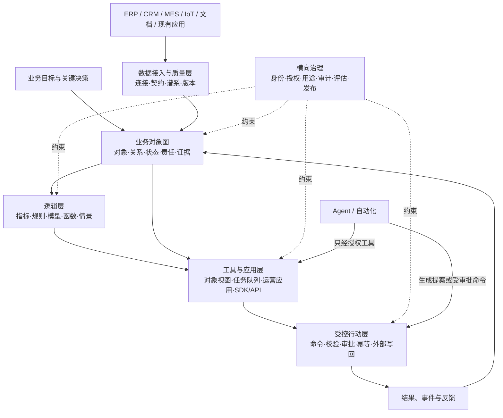

# 从 Palantir 模式到企业本体与工具层：参考架构与落地路线

> **适用范围。** 本文不是对 Palantir Foundry/AIP 的替代品承诺，也不建议复刻其专有实现；其目的在于抽取可迁移的设计原则，帮助企业建立以业务决策为中心的本体与工具层。文中对 Palantir 能力的描述基于公开官方文档，产品实际可用性会因版本、合同和租户权限不同而变化。[1] [2]

## 给管理层的结论

Palantir 的产品不是单一的“知识图谱软件”、聊天机器人或数据仓库。它是一套将企业的**数据、逻辑、行动与安全**围绕同一业务对象模型组织起来的运营平台：Foundry 处理数据运营，AIP 将生成式 AI 接入运营过程，Apollo 负责软件交付与运行控制；本体是这三者用于业务决策的共同操作层。[1]

对企业而言，最值得借鉴的不是产品名称，而是产品化闭环：让一线员工围绕“客户、订单、设备、工单、风险事件”等业务对象工作；让分析、规则和模型在这些对象上产生可解释建议；让真正改变状态的操作走受权限、审批、校验和审计约束的 Action；再把结果回流为下一轮决策的证据。[1] [3]

因此，企业应先建设**决策型业务本体和受控工具层**，再接入 Agent。若先部署通用聊天机器人或向量检索，而没有权威对象、可靠写回路径、最小权限和评估机制，通常只能获得“更会回答问题”的界面，而不是可规模化的运营能力。

## 一、Palantir 产品形态：可以怎样向老板解释

| 层次 | Palantir 公开产品形态 | 企业用户看到/使用的内容 | 可迁移的原则 |
|---|---|---|---|
| 数据运营层 | Foundry 的连接、管道、数据质量、谱系、数据目录与权限能力 | 数据工程师接入 ERP、CRM、MES、文档、传感器等来源；分析师消费可信数据 | 不把数据接入、转换、谱系与权限留在各个孤岛中 |
| 决策本体层 | Ontology 的对象、属性、链接、Function、Action 和安全 | 业务人员看到“订单、客户、库存、设备、工单”等，而不是表名；应用和 API 使用相同业务语言 | 把数据映射成有所有者、来源、生命周期和关系的业务对象 |
| 分析与应用层 | Object Views、分析工具、Workshop/Slate 运营应用、场景模拟 | 运营人员在任务收件箱、地图、设备视图、告警页或协同态势图中判断和操作 | 让应用围绕决策任务设计，而非只交付静态仪表盘 |
| AI 与自动化层 | AIP Logic、AIP Chatbot Studio、AIP Evals、Automate、模型服务 | 领域专家使用 AI 检索、生成提案或处理例外；建设者配置提示、工具、评价与自动化 | Agent 只能在经过绑定的对象、工具、权限和评价边界中行动 |
| 开发与交付层 | OSDK、API、MCP、DevOps、Marketplace、Apollo | 开发者构建业务应用；平台团队版本化、发布、升级和运维产品 | 将可复用的本体、逻辑和应用打包为可版本化的产品 |
| 治理层 | 身份、角色/标记/用途控制、Action 权限、审计、管理控制台 | 安全/合规团队批准数据、功能和高风险操作的边界 | UI 可访问权、数据读权、工具/Action 执行权必须分开管理 |

官方将 Ontology 定义为“数据、逻辑、行动和安全”四要素的操作性整合；数据以对象和链接表达，Action 负责经控制的写回或外部系统编排，Function 与模型承载业务逻辑，安全策略在交互时生效。[1] [2] 它与传统语义层、单纯 RDF/OWL 知识库或数据目录有重叠，但目标更接近于让人和软件围绕同一决策对象协作。

## 二、员工如何真正使用：不是“人人建本体”

企业中绝大多数员工不应直接编辑本体 Schema，也不需要理解底层数据管道。成熟形态是按职责分工，让每类人员在最靠近其工作的界面中使用同一组受治理对象。

| 角色 | 日常动作 | 使用的能力形态 | 对企业本体的要求 |
|---|---|---|---|
| 一线运营人员/领域专家 | 查看任务、调查告警、核实上下文、提交或批准变更 | 运营应用、对象视图、任务收件箱、受控 Action | 关键对象有清晰状态、责任人、证据、权限和允许操作 |
| 主管/调度人员 | 排优先级、跨团队协同、评估“如果…会怎样”、处理例外 | 共同运营态势图、告警队列、情景/模拟和审批队列 | 对象之间可导航，决策影响可追溯，例外有升级规则 |
| 分析师 | 探索对象关系、生成指标、验证假设、制作可复用分析 | 分析工具、模板报告、对象视图、语义查询 | 指标、口径、来源和分析结果能关联到业务对象 |
| 数据/本体建设者 | 接入来源、维护管道、定义对象/链接、配置数据质量 | 数据集成、数据目录、对象建模、规则/Function | 每个对象有权威来源、主键、更新规则、数据契约和所有者 |
| 应用开发者 | 构建针对岗位的应用或集成既有系统 | 低代码应用构建器、SDK、API、类型化工具 | 读模型、命令模型和错误/拒绝路径可通过稳定接口调用 |
| AI/自动化建设者 | 构建提案、工具调用、自动化、评测和观测 | Agent/工作流构建器、函数、评价集、自动化编排 | Agent 可见对象和可调用工具均有显式作用域、参数 Schema 和审计 |
| 管理、风险与安全人员 | 管理组织、身份、数据分级、用途、审批和事件追踪 | 策略控制台、审计日志、访问复核、发布控制 | 页面访问、数据访问、Function 访问和 Action 执行权限独立可审 |

以 Palantir Workshop 为例，它以对象数据作为主要构件、以 Functions 承载业务逻辑、以 Actions 写回对象；官方列出的典型应用包括告警/任务收件箱和共同运营态势图。[4] 这解释了产品在员工侧的“长相”：往往是业务任务界面，而不是一个要求员工搜索表名的通用数据门户。

> **权限设计要点。** 能打开某个运营应用，并不等于能看到该应用可引用的全部数据，也不等于能执行其中的所有写操作。Palantir 的 Workshop 文档明确将模块权限与对象、Action、Function 的权限分离。[5] 这是企业自建工具层必须保留的边界。

## 三、企业本体与工具层的最小可用架构

建议把企业能力拆成六个可独立验证、可逐步替换的层，而非一次性购买或自研“大而全平台”。

| 建设层 | 必须先回答的问题 | 最小交付物 | 常见失败方式 |
|---|---|---|---|
| 业务对象图 | 哪些实体、状态和关系真正决定业务结果？谁拥有定义？ | 10–30 个核心对象、主键/来源/状态、关系、业务词汇表 | 从“全公司数据建模”开始，导致没有可用决策场景 |
| 数据与质量 | 每个对象的权威来源、刷新规则、质量门槛是什么？ | 来源映射、数据契约、质量检查、谱系和异常处理 | 只汇总数据而不记录口径、时间性和冲突处理 |
| 逻辑 | 什么规则、模型或人工判断会影响该决策？ | 指标定义、规则版本、函数/模型契约、评价样本 | 将自然语言制度直接交给 LLM 解释并执行 |
| 工具与应用 | 谁在何时需要看什么、做什么、为什么？ | 一个岗位级运营应用、对象视图、任务队列、拒绝/异常路径 | 交付只读看板，没有写回、协同与结果反馈 |
| 行动与集成 | 哪些操作允许改变内部或外部系统？ | Action/命令目录、参数 Schema、校验、审批、幂等键、审计事件 | 让 Agent 直接拥有数据库或 ERP 写权限 |
| 治理与交付 | 何人可看、可建议、可批准、可执行？如何发布和回滚？ | 权限矩阵、审计策略、评测集、版本/发布与回滚流程 | 将权限、模型评价和部署视为上线后的附属工作 |

## 四、分三阶段实施，而非先做“大本体工程”

### 阶段 1：选定一个高频、可量化、可控写回的决策闭环

选择一个跨系统但边界清晰的场景，例如“维修工单异常分流”“缺料风险处置”“大客户订单例外处理”或“质量偏差调查”。成功标准不应是“接入了多少数据”，而应包含：决策周期、例外处理时长、人工返工、合规遗漏、批准后结果等可测指标。官方的用例交付文档也强调先定义结果与决策，再反推数据与工具，而不是从“做一个销售看板”开始。[6]

此阶段以只读对象视图和人工提交的 Action 为主。即使加入 LLM，也只生成带证据链接的分类/摘要/提案，不自行写回生产系统。

### 阶段 2：固化对象、规则与岗位工具，形成“可操作产品”

将第一阶段稳定下来的对象定义、质量检查、规则、Action 和任务界面版本化。把分析师临时的结论转成可复用指标或规则；把一线的例外处理转成结构化状态、责任人与反馈事件；用真实历史案例形成规则/模型/Agent 的评估集。此时应形成“对象卡片、工具卡片、Action 卡片、审批卡片、指标卡片”五类资产。

### 阶段 3：把已验证的能力产品化，并谨慎引入 Agent

当对象语义、写回控制和评价集稳定后，才把它封装为可安装的领域产品：包括数据契约、对象模型、规则/函数、运营应用、权限模板、演示数据、评测集和运维说明。可借鉴 Marketplace 的产品发现、安装、升级、维护窗口和发布通道思想。[7]

Agent 的角色先限定为“解释、检索、草拟、分流、生成提案、调用低风险只读工具”，再逐步加入有审批的 Action。任何自动执行都要有清楚的适用范围、失败回退、人工接管、审计轨迹和可撤销方案。

## 五、如何判断本体与工具层是否真正赋能企业

不要只统计实体数、三元组数、数据源数或模型调用数。应建立与业务结果和治理质量同时相关的指标。

| 指标组 | 示例 | 应回答的问题 |
|---|---|---|
| 业务结果 | 决策时长、例外闭环率、缺货/停机/返工、按时履约、人工触点 | 系统是否改变了关键决策的速度和质量？ |
| 数据可信度 | 核心对象覆盖率、质量规则通过率、谱系完整度、数据延迟、冲突未决率 | 人和 Agent 是否在可信、及时的共同事实基础上工作？ |
| 工具采用 | 目标岗位覆盖率、任务完成率、人工覆盖/撤销率、跨团队协同次数 | 工具是否嵌入了实际流程，而不是停留在演示？ |
| AI 质量 | 有证据提案比例、任务成功率、幻觉/无权限工具调用率、评测漂移 | Agent 是否在明确任务和边界中变得可靠？ |
| 治理与安全 | 越权尝试阻断率、审批留痕率、审计可追溯率、回滚成功率 | 当系统错误、被滥用或环境变化时，是否仍可控？ |

## 六、需要避免的误解

**第一，不要把 Ontology 等同于“建一个知识图谱”。** 图结构很重要，但运营本体还必须包含状态、业务命令、逻辑、权限、证据和生命周期。

**第二，不要把 Agent 等同于“能够访问所有数据的聊天框”。** 高价值应用往往来自一个明确岗位的一小组对象和工具；广泛数据访问与不受约束写回会同时损害可靠性、合规性和可运营性。

**第三，不要把低代码界面等同于免治理。** 运营应用只有在对象、Action、Function 与应用层权限分离且可审计时，才能安全地把分析接入行动。

**第四，不要用厂商能力目录替代企业路线图。** 企业是否需要完整商业平台、开源组件组合或混合架构，应由场景临界性、现有系统、数据成熟度、安全要求、工程能力、交付节奏和总拥有成本共同决定；公开产品资料不能直接推出其中任何一个结论。

## 参考资料

[1] [Palantir, *Platform overview*](https://palantir.com/docs/foundry/platform-overview/overview/)

[2] [Palantir, *The Ontology system*](https://palantir.com/docs/foundry/architecture-center/ontology-system/)

[3] [Palantir, *AIP overview*](https://palantir.com/docs/foundry/aip/overview/)

[4] [Palantir, *Workshop overview*](https://palantir.com/docs/foundry/workshop/overview/)

[5] [Palantir, *Permissions in Workshop*](https://palantir.com/docs/foundry/workshop/concepts-permissions/)

[6] [Palantir, *Delivering a use case*](https://palantir.com/docs/foundry/getting-started/delivering-a-use-case/)

[7] [Palantir, *Marketplace overview*](https://palantir.com/docs/foundry/marketplace/overview/)
