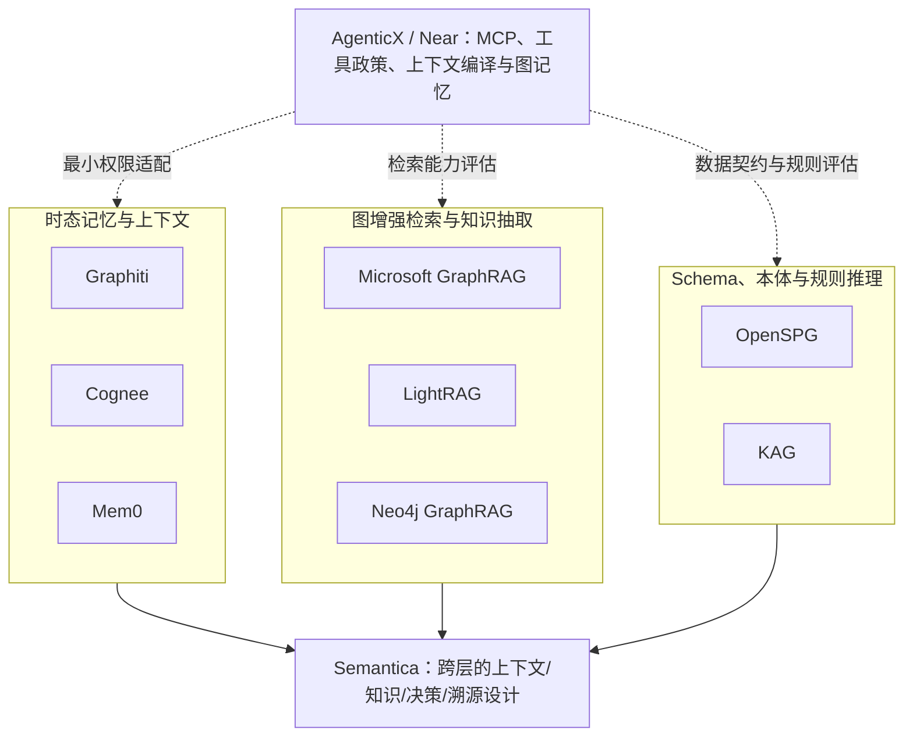

# 与 Semantica 相近的开源项目生态：能力边界与 AgenticX/OAG 适配

## 结论摘要

Semantica 的公开定位横跨上下文图、知识图谱、决策智能、溯源、推理、MCP 与应用接口。开源生态中没有一个候选能够被等价地称为“Semantica 的完整平替”；更准确的理解是，不同项目分别覆盖其中的一层或几层。Graphiti、Cognee 和 Mem0 偏向 Agent 长期记忆；Microsoft GraphRAG、LightRAG 与 Neo4j GraphRAG 偏向从非结构化材料中抽取实体关系并进行图增强检索；OpenSPG 与 KAG 偏向 Schema、本体式语义建模、规则和知识增强推理。[1] [2] [3] [4] [5] [6] [7] [8]

> 星标是 2026-08-14 的可见快照，只能反映当日社区关注度，**不能**代表安全性、企业就绪度、生产性能、许可证适配性或与 AgenticX 的实际兼容性。

## 筛选口径

候选项目必须至少与 Semantica 在下列一种能力上显著重叠：Agent 上下文/记忆、知识图谱、本体或 Schema、GraphRAG、规则/多跳推理、决策信息或来源追溯。筛选时优先使用项目仓库、许可证、官方文档与官方论文；若仅能证明某项功能存在，则不外推为企业权限、审批、租户隔离、完整审计或生产 SLA。

## 分层地图

该图表达的是**能力邻近关系**，不是依赖关系、集成建议或成熟度排名。

## 横向比较

| 项目 | 主要定位 | 星标快照 | 许可证 | 与 Semantica 的主要重叠 | 关键不覆盖边界 | AgenticX/OAG 研究价值 |
|---|---|---:|---|---|---|---|
| [Graphiti][1] | 面向 Agent 的时态 Context Graph，以 event/episode 增量构图、双时态事实和混合图检索为核心。 | 29,916 | Apache-2.0 | 实体—关系图、可选本体、时态事实、语义/全文/图混合检索、episode 来源。 | 不等于企业 OAG 权限、审批、策略治理或完整可审计决策链。 | 作为时态记忆、事实失效、来源追溯与混合 GraphRAG 的实验基线。 |
| [Cognee][2] | 面向 Agent 的持久记忆平台，结合摄取、向量嵌入、知识图谱、图推理和本体生成。 | 30,015 | Apache-2.0 | 多源摄取、知识图谱、向量/语义检索、关系增强和 MCP。 | 官方定位偏记忆与检索，未能据一手资料证明时态事实、强制决策溯源、策略治理或合规审计。 | 作为记忆/GraphRAG 基座候选，优先评估隔离、污染、删除传播和来源回链。 |
| [Mem0][3] | AI Agent 长期记忆层，以 LLM 抽取、向量/关键词/实体混合检索为核心。 | 63,237 | Apache-2.0 | 非结构化对话事实抽取、持久化语义检索、Agent 个性化上下文。 | OSS 当前不含 Graph Memory；未提供类型化本体关系、规则推理、决策溯源或企业 OAG 控制面。 | 作为长时记忆、实体增强混合检索和时态召回基线。 |
| [Microsoft GraphRAG][4] | 从私有非结构化文本抽取实体、关系、关键主张并用社区摘要支持多类图检索。 | 35,492 | MIT | 文本到实体关系、图/向量/文本检索、LLM 生成与复杂问题回答。 | 官方将其定位为方法示范而非官方支持产品；不提供时态记忆、正式本体、决策溯源、权限治理或审计保证。 | 作为社区摘要、多粒度上下文编排和图增强检索基线。 |
| [LightRAG][5] | 轻量知识图谱 RAG，使用图结构与向量联合索引、双层检索、增量更新和 Web/API 服务。 | 38,855 | MIT | 文本实体/关系抽取、图遍历、向量检索、知识发现与引用。 | 不定位为本体、时态记忆、决策溯源、策略治理或企业级权限/审计平台。 | 作为 GraphRAG 检索、知识抽取和增量一致性实验组件。 |
| [KAG][6] | 基于 OpenSPG 与 LLM 的逻辑形式引导混合检索、推理和专业问答框架。 | 8,980 | Apache-2.0 | Schema 约束、KG/文本互索引、语义对齐、逻辑和多跳推理。 | 不是时态 Agent 记忆或完整企业 OAG；未见细粒度决策溯源、权限审计、治理控制或生产 SLA 承诺。 | 作为本体/Schema 约束、结构化推理和专业问答研究候选。 |
| [OpenSPG][7] | 基于 SPG 的语义增强可编程图引擎，包含 Schema、知识构建、KGDSL 规则推理与适配框架。 | 2,194 | Apache-2.0 | 本体式语义 Schema、实体对齐、知识图谱构建及规则/语义推理。 | 不是完整 GraphRAG 或 Agent 长期记忆系统；未见企业级审计证据链、权限治理、审批和决策溯源承诺。 | 作为 Schema、规则正确性、数据对齐和可解释推理实验底座。 |
| [Neo4j GraphRAG for Python][8] | 面向 Neo4j 的 GraphRAG 库，组合向量/全文/图检索、LLM 生成和实验性 KG Builder。 | 1,254 | Apache-2.0；部分代码为 PSF-2.0 | 实体关系抽取、知识图谱构建、嵌入检索与 LLM 问答。 | 不提供时态记忆、本体治理、事实版本/来源审计、策略治理或决策溯源；KG Builder 仍标注实验性。 | 作为 Neo4j、Text2Cypher、实体解析和结构化抽取的基准组件。 |

## 按能力选型，而非按项目“替换”

### 1. 需要长期时态记忆时

Graphiti 的时态关系和 episode 溯源最接近“动态上下文图”方向；Cognee 将记忆、摄取和图增强检索结合得更完整；Mem0 则更偏轻量长时记忆与混合召回。三者都不能替代 AgenticX 的默认工具政策，也不能自动解决跨用户隔离、知识污染、记忆删除、审批或外部 Action 风险。[1] [2] [3]

### 2. 需要从文档获得图增强检索时

Microsoft GraphRAG 适合研究社区摘要和全局/局部上下文组织；LightRAG 适合研究轻量的双层图检索和增量更新；Neo4j GraphRAG for Python 更适合已有 Neo4j 基础设施、希望评估结构化抽取和 Text2Cypher 的场景。它们的共同风险是抽取幻觉、摘要失真、提示注入、查询越权、引用与版本断链，因此不能直接视为自治决策层。[4] [5] [8]

### 3. 需要本体、Schema 和可解释推理时

OpenSPG 适合研究语义 Schema、知识构建与规则推理，KAG 在其上加入 KG/文本互索引、逻辑形式引导的混合推理和专业问答。它们更接近“本体与工具层”的知识工程侧；但领域规则正确、实体对齐、推理解释、来源回链和访问控制仍需由企业数据契约与宿主系统验证。[6] [7]

## AgenticX/OAG 的最小安全评估框架

所有候选都应在隔离、无敏感的合成数据上先通过同一套门槛。输入材料必须有来源 ID 与数据分类；抽取产物必须记录模型、版本、置信度和源片段；检索回答必须能回链来源；写操作默认关闭；任何 MCP 服务只开放已批准的只读工具；工具调用继续经过 AgenticX 的 default-deny 政策和独立审计。对图查询或 Text2Cypher，还应显式测试提示注入、越权读取、图污染、错误关系、过期事实和删除传播。

| 评估层 | 最低问题 | 通过证据 |
|---|---|---|
| 数据与来源 | 每个节点/边能否回到来源和版本？ | 来源 ID、版本、抽取时间和源片段齐全。 |
| 本体与规则 | 类型、关系与规则违反时如何处理？ | Schema/规则失败样本与可解释错误输出。 |
| 检索与生成 | 是否存在无依据的实体/关系/摘要？ | 带引用的回答集、反事实测试和人工抽检。 |
| 隔离与权限 | 能否跨用户、跨项目或跨密级检索？ | 明确的拒绝测试、工具白名单与权限日志。 |
| 行动边界 | 检索结果是否能直接写回业务系统？ | 默认无写权限；写入仅通过人工审批、参数校验、审计和回滚。 |
| 运维与成本 | 索引、更新、嵌入、图后端异常时如何降级？ | 压力/故障脚本、成本预算和恢复演练。 |

## 采纳边界

本报告不建议从八个项目中直接挑选一个作为“Semantica 平替”并进入生产。合理路径是先用业务闭环决定所需层：如果缺的是记忆，比较 Graphiti/Cognee/Mem0；如果缺的是文档图检索，比较 GraphRAG/LightRAG/Neo4j；如果缺的是 Schema 与规则推理，比较 OpenSPG/KAG。然后为唯一选定层制定对象、来源、关系、政策、权限和 Action 数据契约，并在隔离数据上做只读评估。只有当评估证明 AgenticX 的既有 MCP、工具政策、上下文编译和图记忆不能覆盖具体需求时，才进入单独批准的适配设计。

## 参考资料

[1]: https://github.com/getzep/graphiti "getzep/graphiti"
[2]: https://github.com/topoteretes/cognee "topoteretes/cognee"
[3]: https://github.com/mem0ai/mem0 "mem0ai/mem0"
[4]: https://github.com/microsoft/graphrag "microsoft/graphrag"
[5]: https://github.com/HKUDS/LightRAG "HKUDS/LightRAG"
[6]: https://github.com/OpenSPG/KAG "OpenSPG/KAG"
[7]: https://github.com/OpenSPG/openspg "OpenSPG/openspg"
[8]: https://github.com/neo4j/neo4j-graphrag-python "neo4j/neo4j-graphrag-python"
