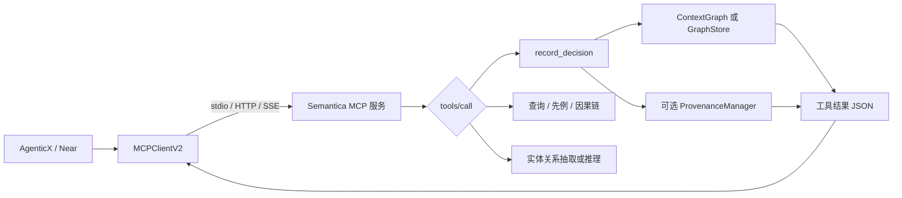

# Semantica 源码笔记

## 问题与边界

### 已被锁定源码证明的能力

在本次锁定版本中，Semantica 提供了一个可组合的 Python 知识与上下文层。其 MCP 入口把实体/关系抽取、图实体写入、决策记录、先例查询、因果链、规则推理、图分析和导出作为工具公开；`DecisionRecorder` 则将决策、实体连接、可选嵌入和可选 PROV-O 跟踪组合为同一存储流程。因此，它可作为研究“受证据约束的 Agent 上下文与决策溯源”时的机制参考，而不能被直接描述为已经完成企业治理的平台。[E-001] [E-003] [E-005]

### 未被锁定源码证明的能力

锁定源码并不能证明 Semantica 已提供 AgenticX/Near 所需的用户身份传播、逐工具授权、租户隔离、企业审批、外部写回网关、发布治理或安全认证。已读取的包内 MCP 服务通过 stdio JSON-RPC 直接分派工具处理器，入口没有可见的、与用户或组织身份绑定的认证和政策评估；`ContextGraph` 的文件说明也明确其为内存 `GraphStore` 实现。这些事项是采用方的系统设计和运行验证责任，不能由本次静态源码直接外推。[E-002] [E-004]

## 运行验证状态

| 项目 | 记录 |
|---|---|
| 执行命令 | 未执行任何 Semantica 安装、测试、服务或 MCP 进程。 |
| 结果 / 退出码 | `not_run`。 |
| 原因 | 本轮采用静态验证；项目核心依赖包含 PyTorch、Transformers、FAISS、RDFLib、文档/图像处理库和多类可选外部后端，且用户未授权在隔离环境安装或运行。 |
| 置信度边界 | 关于源代码控制流、接口和显式异常路径的结论为高置信源码证据；不主张运行时兼容性、性能、持久化、并发或安全性。 |

## 核心抽象

| 名称 | 职责 | 精确源码位置 |
|---|---|---|
| `MCPServerConfig` | AgenticX 侧 MCP 客户端配置，限制 `command` 与 `url` 二选一，并推断 stdio、streamable HTTP 或 SSE 传输。 | AgenticX `agenticx/tools/remote_v2.py:88-154` |
| `MCPClientV2` | AgenticX 侧的持久 MCP 会话、发现、调用、传输重建与采样桥接。 | AgenticX `agenticx/tools/remote_v2.py:165-439` |
| `ToolPolicyStack` | AgenticX 侧多层工具允许/拒绝机制，显式拒绝优先，默认拒绝。 | AgenticX `agenticx/tools/policy.py:97-207` |
| `MemoryGraphStore` | AgenticX 侧 Graphiti/Kuzu 记忆图封装，覆盖配置检查、延迟初始化、故障处理和会话回合摄入。 | AgenticX `agenticx/memory/graph/store.py:128-427` |
| `ContextGraph` | Semantica 的内存图默认实现，包含节点、边、时间有效期、图查询与决策跟踪。 | Semantica `semantica/context/context_graph.py:2-20, 301-410, 416-440` |
| `DecisionRecorder` | Semantica 的决策节点、实体关联、可选嵌入、可选溯源、政策、异常和批准链操作封装。 | Semantica `semantica/context/decision_recorder.py:88-188, 190-424` |
| `PluginRegistry` | Semantica 的插件发现、依赖加载、初始化、卸载和配置错误包装。 | Semantica `semantica/core/plugin_registry.py:61-349` |
| `semantica.mcp_server` | Semantica 的 stdio MCP 服务，公开工具/资源表与 JSON-RPC 分派循环。 | Semantica `semantica/mcp_server/__init__.py:1-619` |

## 主执行路径

第一，AgenticX 的 `MCPServerConfig` 验证本地进程或远程 URL 的传输配置，`MCPClientV2` 创建持久会话、缓存工具列表、串行化 stdio RPC，并在可恢复传输错误时重建连接后重试一次。[E-010] [E-011]

第二，Semantica MCP 服务器将 `tools/call` 的名称映射到静态 `TOOLS` 表并调用相应 Python 函数。入口声明的工具既包含只读抽取/查询，也包含写图的 `record_decision`、`add_entity`、`add_relationship` 以及导出能力。[E-001] [E-002]

第三，`record_decision` 要求 `category`、`scenario`、`reasoning`、`outcome` 和 `confidence`，随后调用图实例的 `record_decision`。更底层的 `DecisionRecorder.record_decision` 会在可用时生成推理嵌入、写入决策节点、连接实体，并仅在传入 `ProvenanceManager` 时调用溯源逻辑。[E-003]

第四，默认 `ContextGraph` 是内存图，节点和边保留 `valid_from` / `valid_until` 并具有活动性判断。这能表达部分时态上下文，但不是持久化、多租户或事务保证。[E-004]

## 失败与降级行为

| 失败情形 | 处理方式 | 证据 ID |
|---|---|---|
| AgenticX 缺少 MCP SDK | 客户端创建会话时检测 `ClientSession is None` 并抛出明确的 `RuntimeError`。 | E-010 |
| AgenticX 传输中断 | `call_tool` 最多调用两次；仅可识别的 pipe/connection/stream 错误会触发连接重置和一次重试。 | E-011 |
| AgenticX 工具不被政策允许 | `ToolPolicyStack` 优先拒绝命中 deny 或类别 deny 的工具；无规则时默认拒绝。 | E-012 |
| Semantica 图加载失败 | `_get_graph` 捕获持久图加载异常并记录 warning，但仍返回新建图。 | E-002 |
| Semantica MCP 参数不足或工具未知 | 工具处理器返回错误 JSON；协议层对未知工具返回 `-32601`。 | E-002 |
| Semantica MCP 工具异常 | `_handle` 捕获处理器异常、记录日志并返回 JSON-RPC `-32603`。 | E-002 |
| Semantica 决策记录失败 | `DecisionRecorder.record_decision` 记录异常后重新抛出；该路径未展示补偿或事务语义。 | E-003 |
| Semantica 插件初始化失败 | Registry 先带配置构造，发生 `TypeError` 时回退无参构造；其他异常包装为 `ConfigurationError`。 | E-006 |
| Semantica 时间值格式错误 | 查询时解析失败记录 warning 并按 Always-Active 处理；写入规范化遇到非法值则抛 `ValueError`。 | E-004 |

## 扩展点

| 扩展机制 | 契约与边界 | 证据 ID |
|---|---|---|
| Semantica 插件 | `PluginRegistry` 要求插件类至少实现 `initialize` 与 `execute`，支持路径发现、依赖递归加载和 `cleanup`/`close`；动态加载第三方代码必须由外层审查和隔离。 | E-006 |
| Semantica GraphStore/Provenance | `DecisionRecorder` 接受 `graph_store`、可选 `embedding_generator` 与可选 `provenance_manager`；决策与溯源依赖按注入存在，并非无条件启用。 | E-003 |
| Semantica MCP | 通过静态 `TOOLS` / `RESOURCES` 表增加接口；当前入口是服务级工具粒度，没有可见的调用方授权钩子。 | E-002 |
| AgenticX MCP 客户端 | 支持 stdio、streamable HTTP、SSE，能发现工具并由 schema 生成包装；配置有服务器级 `enabled_tools` 和 `assign_to_agents` 字段，但本次读取的 `create_all_tools` 未使用前者过滤。 | E-010 [E-013] |
| AgenticX 工具政策 | `ToolPolicyStack`、路径、计划模式、命令拒绝和类别政策组合为白名单式调用边界。 | E-012 |

## 证据表

| 证据 ID | 主张 | 来源类型 | 精确位置 | SHA / 编号 | 置信度 |
|---|---|---|---|---|---|
| E-001 | Semantica 发布 CLI、server、worker、Explorer 与 MCP 五个脚本入口；MCP 为 `semantica.mcp_server:main`。 | 本地源码 | `pyproject.toml:250-256` | `94d0c3d` | 高 |
| E-002 | Semantica MCP 是 stdio JSON-RPC 服务；静态工具表包含读写图、决策、推理、导出；请求循环有基础 JSON-RPC 错误处理。 | 本地源码 | `semantica/mcp_server/__init__.py:65-81, 130-290, 297-619` | `94d0c3d` | 高 |
| E-003 | `DecisionRecorder` 可选生成推理嵌入、写图、连接实体；仅注入 `provenance_manager` 时跟踪 PROV-O；异常会重新抛出。 | 本地源码 | `semantica/context/decision_recorder.py:88-188` | `94d0c3d` | 高 |
| E-004 | `ContextGraph` 被实现并描述为内存 `GraphStore`；节点与边有时态边界和活动判断，时间解析有 warning / fail-fast 两条路径。 | 本地源码 | `semantica/context/context_graph.py:2-20, 142-188, 301-410, 416-440` | `94d0c3d` | 高 |
| E-005 | 决策记录测试使用 mock 图存储/嵌入/溯源依赖，覆盖成功、异常、政策版本、批准链和溯源调用，但不构成端到端后端验证。 | 本地源码 | `tests/context/test_decision_recorder.py:17-340` | `94d0c3d` | 高 |
| E-006 | `PluginRegistry` 提供动态路径发现、依赖递归、带/无配置构造回退、初始化/卸载和配置错误包装。 | 本地源码 | `semantica/core/plugin_registry.py:61-349` | `94d0c3d` | 高 |
| E-010 | AgenticX 的 `MCPServerConfig` 限制 command/url 二选一并推断三类传输；`MCPClientV2` 维护 session / cache / locks。 | 本地源码 | `agenticx/tools/remote_v2.py:88-227` | `de771f7` | 高 |
| E-011 | AgenticX MCP 客户端遇到指定可恢复传输错误时会重置连接并至多重试一次。 | 本地源码 | `agenticx/tools/remote_v2.py:57-82, 395-439` | `de771f7` | 高 |
| E-012 | AgenticX 多层政策栈拒绝优先，若没有允许规则则默认拒绝；含路径、计划模式、命令与类别控制。 | 本地源码 | `agenticx/tools/policy.py:57-191, 212-337` | `de771f7` | 高 |
| E-013 | AgenticX `create_all_tools` 包装已发现的所有工具；本次审阅范围中未见其使用 `enabled_tools` 过滤。 | 本地源码 | `agenticx/tools/remote_v2.py:487-546` | `de771f7` | 高 |
| E-014 | AgenticX Graphiti/Kuzu 记忆图要求配置启用和 graphiti-core，当前 MVP 只支持 Kuzu；`ingest_turn` 将聊天回合写成 episode，初始化含超时与锁/损坏处理。 | 本地源码 | `agenticx/memory/graph/store.py:120-247, 275-427` | `de771f7` | 高 |
| E-015 | DeepWiki 概览索引为 `e90bd048`，早于锁定 SHA；其四层架构概述与模块化定位只能作为二级说明。 | DeepWiki | `https://deepwiki.com/semantica-agi/semantica`，访问日 2026-08-14 | `e90bd048` | 低 |

## 交叉核验

| 候选主张 | 证据 | 结果 | 修正后的表述 |
|---|---|---|---|
| Semantica MCP 能让 Agent 调用知识图、决策和推理能力。 | E-002 | 是 | 固定入口的静态工具表公开这些能力；未执行实际调用。 |
| Semantica MCP 工具具有企业级逐用户授权。 | E-002 | 否 | 已读入口没有身份解析、逐用户授权或工具政策；必须由宿主或网关补充。 |
| Semantica 决策记录天然产生完整 PROV-O 溯源。 | E-003、E-005 | 部分 | 只有注入 `provenance_manager` 才调用溯源；测试以 mock 验证调用，不验证后端结果。 |
| Semantica `ContextGraph` 可直接作为 AgenticX 长期生产记忆。 | E-004、E-014 | 否 | Semantica 默认图是内存实现；AgenticX 已有 Graphiti/Kuzu 记忆图，但其生产属性也未在本轮运行验证。 |
| Semantica MCP 是需要内化进 AgenticX 的协议客户端能力。 | E-010、E-011、E-012、E-013 | 否 | AgenticX 已有多传输 MCP 客户端与工具政策；合理研究对象是受控的上游服务适配。 |
| Semantica 可以模块化选择性使用。 | E-003、E-006、E-015 | 部分 | 注入式依赖与插件注册提供一定可组合性；依赖面、版本和真实部署耦合没有运行验证。 |
| DeepWiki 可以证明锁定版本的当前行为。 | E-015 | 否 | DeepWiki 索引 SHA 早于锁定版本，且交互问答没有返回可引用答案；不进入 P0/P1 证据。 |
