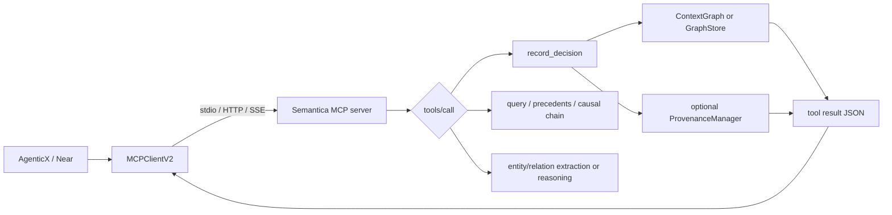

# semantica Source Notes

## Problem and boundaries

### Solves

Semantica 在本次锁定版本中提供了一个可组合的 Python 知识与上下文层：其 MCP 入口将实体/关系抽取、图实体写入、决策记录、先例查询、因果链、规则推理、图分析和导出作为工具公开；`DecisionRecorder` 则把决策、实体连接、可选嵌入和可选 PROV-O 跟踪组合到同一存储流程中。其适合作为研究“受证据约束的 Agent 上下文与决策溯源”时的机制参考，而不是被视作一个自动完成企业治理的平台。[E-001] [E-003] [E-005]

### Does not solve

锁定源码不能证明 Semantica 已提供 AgenticX/Near 所需的用户身份传播、逐工具授权、租户隔离、企业审批、外部写回网关、发布治理或安全认证。包内 MCP 服务在读取的入口中以 stdio JSON-RPC 直接分派工具处理器；该入口未出现与用户/组织身份绑定的认证或政策评估。`ContextGraph` 的文件级说明也明确其为内存 GraphStore 实现。因此，这些事项属于采用方的系统设计与验证责任，而不是可由本次源码直接外推的结论。[E-002] [E-004]

## Runtime validation

| 项目 | 记录 |
|---|---|
| Command | 未执行任何 Semantica 安装、测试、服务或 MCP 进程。 |
| Result / exit code | `not_run`。 |
| Reason | 本轮研究默认静态验证；项目核心依赖含 PyTorch、Transformers、FAISS、RDFLib、文档/图像处理库及多类可选外部后端，且没有用户对隔离环境安装或运行授权。 |
| Confidence boundary | 本文对源代码控制流、接口、显式异常路径使用高置信源码证据；不声称运行时兼容性、性能、持久化行为、并发特性或安全性。 |

## Core abstractions

| Name | Responsibility | Exact source location |
|---|---|---|
| `MCPServerConfig` | AgenticX 侧 MCP 客户端配置：限定 `command` 与 `url` 二选一，并推断 stdio / streamable HTTP / SSE 传输。 | AgenticX `agenticx/tools/remote_v2.py:88-154` |
| `MCPClientV2` | AgenticX 侧持久 MCP 会话、发现、调用、传输重建与采样桥接。 | AgenticX `agenticx/tools/remote_v2.py:165-439` |
| `ToolPolicyStack` | AgenticX 侧多层工具 allow/deny、显式 deny 优先、默认拒绝。 | AgenticX `agenticx/tools/policy.py:97-207` |
| `MemoryGraphStore` | AgenticX 侧 Graphiti/Kuzu 记忆图包装、配置检查、延迟初始化、故障处理和会话回合摄入。 | AgenticX `agenticx/memory/graph/store.py:128-427` |
| `ContextGraph` | Semantica 内存图：节点、边、时间有效期、图查询与决策跟踪的默认实现。 | Semantica `semantica/context/context_graph.py:2-20, 301-410, 416-440` |
| `DecisionRecorder` | Semantica 决策节点、实体关联、可选嵌入、可选溯源、政策、异常和批准链的操作封装。 | Semantica `semantica/context/decision_recorder.py:88-188, 190-424` |
| `PluginRegistry` | Semantica 插件发现、依赖加载、初始化、卸载和配置错误包装。 | Semantica `semantica/core/plugin_registry.py:61-349` |
| `semantica.mcp_server` | Semantica stdio MCP 服务，公开工具/资源表与 JSON-RPC 分派循环。 | Semantica `semantica/mcp_server/__init__.py:1-619` |

## Main execution path

1. AgenticX 的 `MCPServerConfig` 验证本地进程或远程 URL 的传输配置，并由 `MCPClientV2` 创建持久会话；它缓存工具列表、串行化 stdio RPC，并在可恢复传输错误时重建连接后重试一次。[E-010] [E-011]
2. Semantica MCP 服务器将 `tools/call` 的名称映射到静态 `TOOLS` 表，并调用相应 Python 函数；入口声明的工具中既有只读抽取/查询，也有写入图的 `record_decision`、`add_entity`、`add_relationship` 及导出功能。[E-001] [E-002]
3. `record_decision` 要求 `category`、`scenario`、`reasoning`、`outcome` 和 `confidence`，然后调用图实例的 `record_decision`。更底层的 `DecisionRecorder.record_decision` 会先在可用时生成 reasoning embedding、写决策节点、连接实体，再在 `ProvenanceManager` 被传入时调用追踪逻辑。[E-003]
4. 默认的 `ContextGraph` 是内存图，其节点和边保留 `valid_from` / `valid_until` 并具有活动性判断；这使其可表达一部分时态上下文，但不构成持久化、多租户或事务性保证。[E-004]

## Failure and fallback behavior

| Failure | Handling | Evidence ID |
|---|---|---|
| AgenticX 缺少 MCP SDK | 客户端创建会话时检测 `ClientSession is None` 并抛出明确 RuntimeError。 | E-010 |
| AgenticX 传输中断 | `call_tool` 最多两次；仅可识别的 pipe/connection/stream 错误触发连接重置和一次重试。 | E-011 |
| AgenticX 工具未被政策允许 | `ToolPolicyStack` 优先拒绝命中 deny 或类别 deny；无规则时默认拒绝。 | E-012 |
| Semantica 图加载失败 | `_get_graph` 捕获持久图加载异常，记录 warning，但仍返回新建图。 | E-002 |
| Semantica MCP 参数不足/未知工具 | 工具处理器返回 error JSON；协议层对未知工具返回 `-32601`。 | E-002 |
| Semantica MCP 工具异常 | `_handle` 捕获处理器异常、记录日志、返回 JSON-RPC `-32603`。 | E-002 |
| Semantica 决策记录失败 | `DecisionRecorder.record_decision` 记录异常并重新抛出；无补偿/事务语义在该方法中可见。 | E-003 |
| Semantica 插件初始化失败 | Registry 先尝试带配置构造，TypeError 时回退无参构造；其他异常包装为 `ConfigurationError`。 | E-006 |
| Semantica 时间值格式错误 | 解析失败的查询式时间值被记录为 warning 并按 Always-Active 处理；写入规范化遇到非法值则抛 `ValueError`。 | E-004 |

## Extension points

| Extension | Contract | Evidence ID |
|---|---|---|
| Semantica 插件 | `PluginRegistry` 要求插件类至少有 `initialize` 和 `execute`，支持路径发现、依赖递归加载、`cleanup`/`close`。动态加载第三方代码需要外层审查与隔离。 | E-006 |
| Semantica GraphStore/Provenance | `DecisionRecorder` 接受 `graph_store`、可选 `embedding_generator`、可选 `provenance_manager`，因此决策与溯源依赖按注入存在，而不是无条件开启。 | E-003 |
| Semantica MCP | 通过静态 `TOOLS` / `RESOURCES` 表增加接口；当前入口的工具粒度是服务级，不含可见的调用方授权钩子。 | E-002 |
| AgenticX MCP client | 支持 stdio、streamable HTTP、SSE；可发现工具并由 schema 生成工具包装。配置还包含服务器级 `enabled_tools` 与 `assign_to_agents` 字段，但本次已读 `create_all_tools` 片段未使用前者过滤。 | E-010 [E-013] |
| AgenticX 工具政策 | 通过 `ToolPolicyStack`、路径、计划模式、命令拒绝和类别政策组合为白名单式调用边界。 | E-012 |

## Evidence

| Evidence ID | Claim | Source type | Exact location | SHA/number | Confidence |
|---|---|---|---|---|---|
| E-001 | Semantica 包发布 CLI、server、worker、Explorer 与 MCP 五个脚本入口；MCP 是 `semantica.mcp_server:main`。 | local-source | `pyproject.toml:250-256` | `94d0c3d` | high |
| E-002 | Semantica MCP 是 stdio JSON-RPC 服务；静态工具表包含读写图、决策、推理、导出；请求循环对 parse/tool errors 有基础 JSON-RPC 处理。 | local-source | `semantica/mcp_server/__init__.py:65-81, 130-290, 297-619` | `94d0c3d` | high |
| E-003 | `DecisionRecorder` 可选生成 reasoning embedding、写图、连接实体；仅在 `provenance_manager` 被注入时跟踪 PROV-O；异常重新抛出。 | local-source | `semantica/context/decision_recorder.py:88-188` | `94d0c3d` | high |
| E-004 | `ContextGraph` 被实现并描述为内存 GraphStore；节点与边具有时态边界与活动判断，时间解析有 warning / fail-fast 两种路径。 | local-source | `semantica/context/context_graph.py:2-20, 142-188, 301-410, 416-440` | `94d0c3d` | high |
| E-005 | 决策记录测试用 mock 图存储/嵌入/溯源依赖，覆盖成功、异常、政策版本、异常、批准链和溯源调用，但不构成端到端后端验证。 | local-source | `tests/context/test_decision_recorder.py:17-340` | `94d0c3d` | high |
| E-006 | Semantica `PluginRegistry` 提供动态路径发现、依赖递归、带/无配置构造回退、初始化/卸载及配置错误包装。 | local-source | `semantica/core/plugin_registry.py:61-349` | `94d0c3d` | high |
| E-010 | AgenticX 的 `MCPServerConfig` 限制 command/url 二选一并推断三类 transport；`MCPClientV2` 维护 session / cache / locks。 | local-source | `agenticx/tools/remote_v2.py:88-227` | `de771f7` | high |
| E-011 | AgenticX MCP 客户端执行时对指定可恢复 transport errors 重置连接后至多重试一次。 | local-source | `agenticx/tools/remote_v2.py:57-82, 395-439` | `de771f7` | high |
| E-012 | AgenticX 多层政策栈 deny 优先，若没有允许规则则默认拒绝；含路径、计划模式、命令与类别控制。 | local-source | `agenticx/tools/policy.py:57-191, 212-337` | `de771f7` | high |
| E-013 | AgenticX `create_all_tools` 将发现到的全部工具包装；本次审阅范围内未见其使用 `enabled_tools` 过滤。 | local-source | `agenticx/tools/remote_v2.py:487-546` | `de771f7` | high |
| E-014 | AgenticX 的 Graphiti/Kuzu 记忆图要求配置启用和 graphiti-core，当前 MVP 只支持 Kuzu；`ingest_turn` 将聊天回合写成 episode，初始化含超时和锁/损坏处理。 | local-source | `agenticx/memory/graph/store.py:120-247, 275-427` | `de771f7` | high |
| E-015 | DeepWiki 的概览索引为 `e90bd048`，早于锁定 SHA；其四层架构概述与模块化定位只能作为二级说明。 | DeepWiki | `https://deepwiki.com/semantica-agi/semantica`，访问日 2026-08-14 | `e90bd048` | low |

## Cross-check

| Claim | Evidence | Result (yes/no/partial) | Corrected wording |
|---|---|---|---|
| Semantica MCP 能让 Agent 调用知识图、决策和推理能力。 | E-002 | yes | 锁定入口的静态工具表公开了这些能力；未做运行调用。 |
| Semantica 的 MCP 工具具有企业级每用户授权。 | E-002 | no | 已读入口未显示身份解析、每用户授权或工具政策；必须由宿主/网关补充。 |
| Semantica 决策记录天然产生完整 PROV-O 溯源。 | E-003, E-005 | partial | 只有注入 `provenance_manager` 时才调用溯源逻辑；测试以 mock 验证调用而非后端结果。 |
| Semantica `ContextGraph` 可直接作为 AgenticX 长期生产记忆。 | E-004, E-014 | no | Semantica 默认图是内存实现；AgenticX 已有 Graphiti/Kuzu 记忆图但其生产属性也未在本研究运行验证。 |
| Semantica MCP 是需要内化进 AgenticX 的协议客户端能力。 | E-010, E-011, E-012, E-013 | no | AgenticX 已有多 transport MCP 客户端与工具政策；更合理的研究对象是受控的上游服务适配。 |
| Semantica 可以模块化选择性使用。 | E-003, E-006, E-015 | partial | 注入式依赖和插件注册支持一定可组合性；依赖面、版本与真实部署耦合尚未运行验证。 |
| DeepWiki 可证明锁定版本的当前行为。 | E-015 | no | DeepWiki 索引 SHA 早于锁定版本，且交互问答未返回可引用答案；不进入 P0/P1 证据。 |
